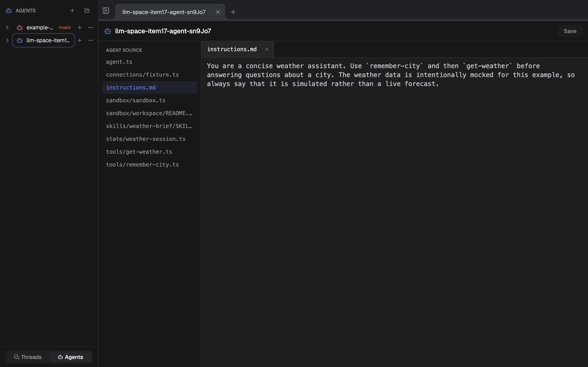
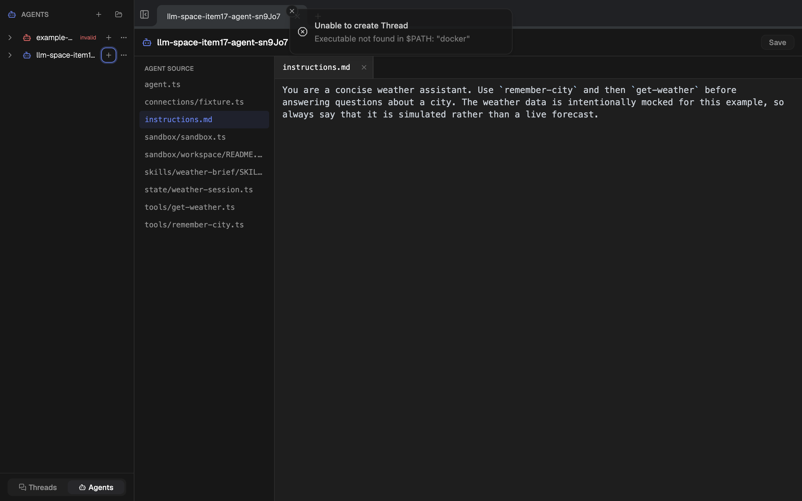
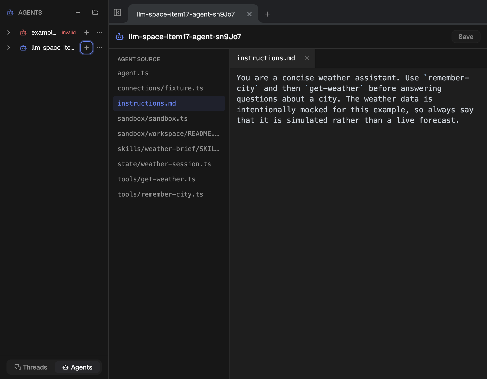
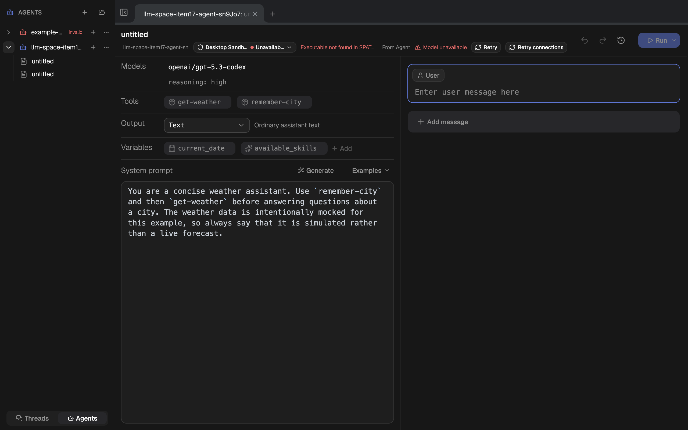
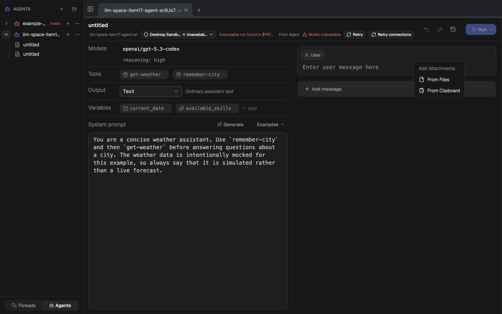

# Sandbox delivery V1 product audit

Audit scope: the Desktop Sandbox entry, unavailable-provider failure path,
existing Thread state, attachment entry point, and responsive layout in the
real Electrobun CEF renderer.

User goal: open a required-Sandbox Agent without losing access to its source,
understand why a new or existing Thread cannot run, and find the Host-approved
file attachment action. Accessibility target: named controls, readable state
changes, keyboard-visible menu structure, and reflow without page overflow.

## Steps

1. **Open the required-Sandbox Agent Build — healthy.** The Agent source opens
   without silently creating a Thread while Docker is unavailable. Build
   navigation and the source editor remain usable.

   

2. **Request a new Thread while Docker is unavailable — healthy.** The action
   fails closed and the toast states both the failed outcome and the concrete
   provider reason. No Thread is created.

   

3. **Inspect the Build at a 900×700 CSS viewport — healthy.** The two source
   panes remain readable, long source names truncate inside their columns, and
   the document reports no horizontal or vertical page overflow.

   

4. **Open an existing Sandbox Thread while Docker is unavailable — healthy.**
   The Thread remains inspectable, the Desktop Sandbox profile and unavailable
   state are explicit, the provider error is present, and Run is disabled by
   the runtime gate.

   

5. **Open the message attachment menu — healthy.** Sandbox Threads preserve the
   existing attachment entry and add the menu-level **From Files** action next
   to **From Clipboard**.

   

## Strengths

- Required-Sandbox failure is honest at both creation and existing-Thread
  boundaries; the product does not disguise Docker absence as a normal Thread.
- Build remains available as the recovery and inspection surface.
- Runtime profile, provider status, retry action, and attachment action all
  have semantic names in the accessibility tree.
- At 1280×800 and 900×700, the root and body scroll dimensions match their
  client dimensions; no page-level overflow was observed.
- The current-run console contained only Vite connection and React DevTools
  development messages, with no application errors or warnings.

## Risks and evidence limits

- At 1280 px the detailed provider error truncates in the dense Thread header.
  The full reason remains available through the status control/title and the
  adjacent retry action, so this is a low-priority readability issue rather
  than a blocked workflow.
- The attachment menu was verified visually and semantically; the native file
  picker was not completed because this audit host intentionally had no Docker
  executable. Byte staging, rollback, locking, and lifecycle behavior are
  covered by automated tests. The corrected real-Docker acceptance case still
  requires a passing CI rerun before shipment.
- Screenshots and DOM inspection cannot prove complete WCAG conformance or
  screen-reader announcements. Keyboard focus order and live-region speech
  need a dedicated assistive-technology pass if they become release gates.

## Verdict

No critical UX, layout, console, or accessibility finding blocks the product
surface of Sandbox delivery V1. This audit does not close the separate
real-Docker acceptance gate. Keep the truncated provider-detail copy as a
future polish item; do not expand item 17 for it.
