# Agent Project Debugging Parity Audit

- Audit mode: combined UX and accessibility review
- Product surface: real LLM Space Electrobun CEF renderer
- User goal: open a checked-in Agent Project, understand its effective model/runtime, override debug parameters when necessary, and exercise a Sandbox-required Agent without editing undocumented source
- Capture dates: 2026-07-20 discovery; 2026-07-21 implementation acceptance

## Overall verdict

Implementation acceptance passes. Editable Project Threads now keep the shared
model selector and parameter controls visible, explicit model configuration is
persisted as a Thread override, and Desktop Direct/Sandbox may execute it under
an explicit Host authority while Local Server stays source-owned and read-only.
Runtime Profile changes happen in the current Thread without clearing messages,
Run History, or Desktop Runtime Session state. A separate checked-in Sandbox
example demonstrates `defineSandbox({})`, the workspace seed, and canonical
read/write/bash helpers.

## Steps

### 1. Inspect the checked-in example source — healthy but incomplete

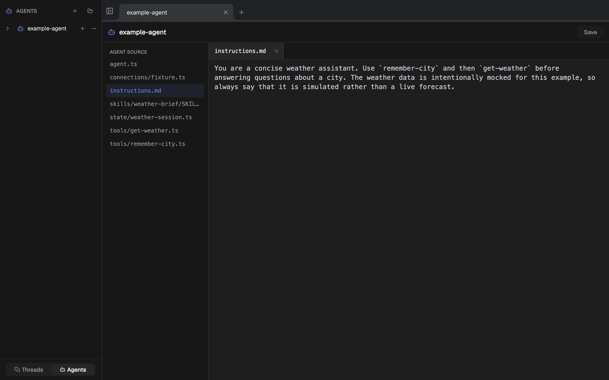

The Build surface is healthy and the source tree is understandable. No
Sandbox declaration, workspace seed, or canonical execution tools are present,
so users cannot discover the shipped Sandbox capability through this example.

### 2. Create the default Project Thread — blocked by a stale model default

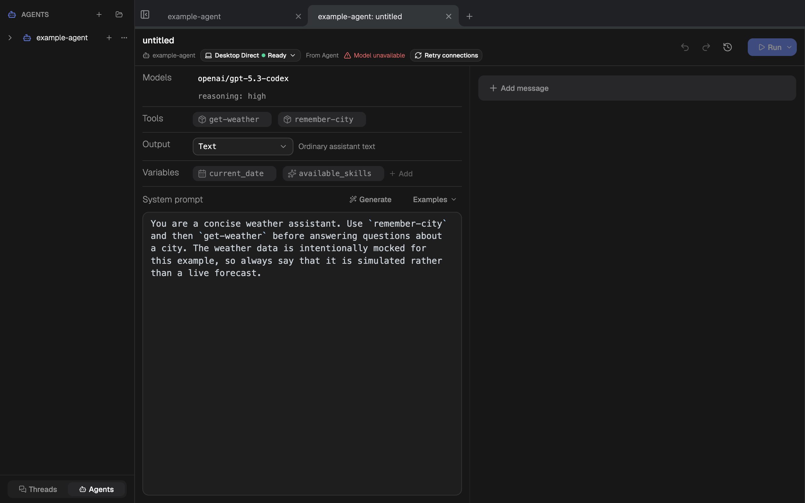

The Thread opens in `Desktop Direct · Ready`, but `Model unavailable` conflicts
with the still-prominent `openai/gpt-5.3-codex` value. The provenance label
`From Agent` is useful, but there is no visible next action beside the error.

### 3. Open model parameters — functionally healthy, poorly discoverable

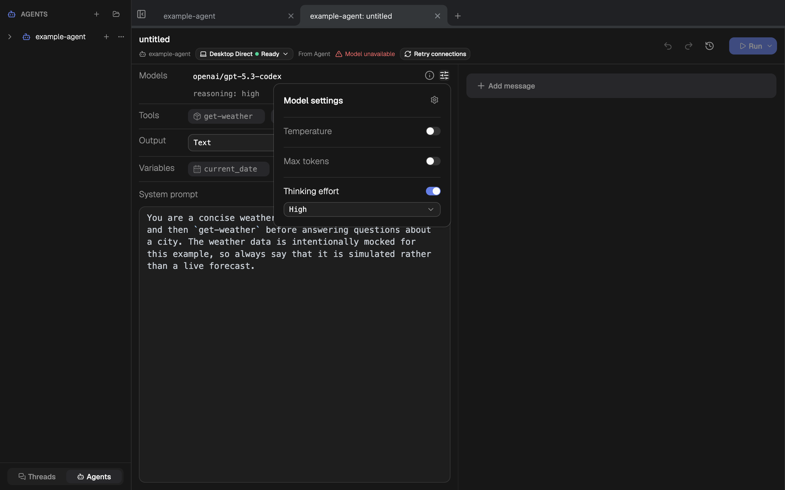

Temperature, max tokens, and thinking effort are editable through the reused
Thread popover. The icon appears primarily on hover, so the control is easy to
miss when the model is already unavailable.

### 4. Open the model selector — healthy

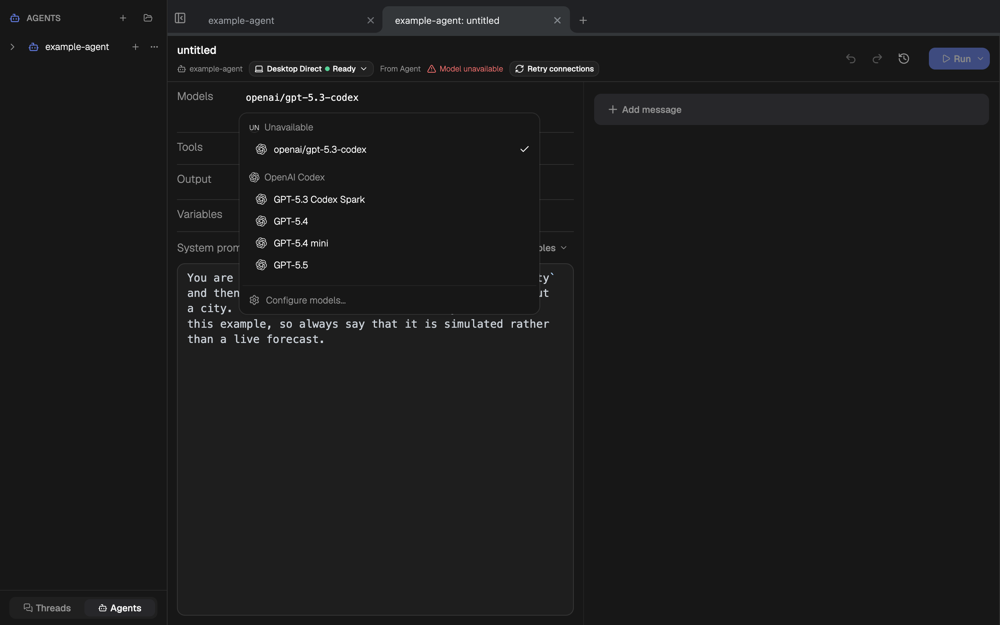

The reused selector clearly separates the unavailable source model from
available configured models and provides `Configure models…`. The trigger has
an accessible name in the DOM, but its low-visibility idle state remains a UX
risk.

### 5. Choose a Thread override — healthy

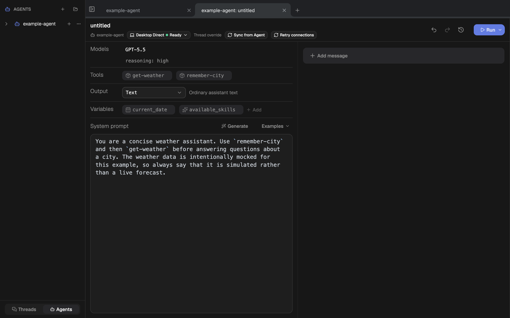

Choosing GPT-5.5 changes provenance from `From Agent` to `Thread override` and
reveals `Sync from Agent`. This is the correct ownership model: source remains
unchanged and the Project Thread owns the debug override.

### 6. Add a Sandbox requirement — healthy stale-state transition

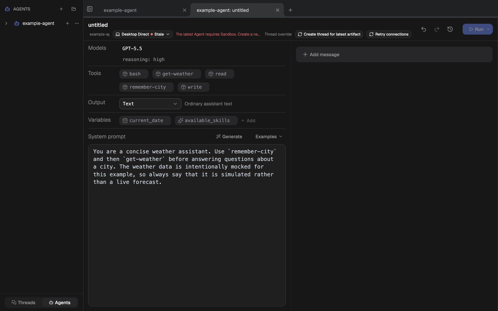

The existing Direct Thread becomes `Stale`, explicitly says the latest Agent
requires Sandbox, and offers `Create thread for latest artifact`. Authority is
not silently migrated or downgraded.

### 7. Create the latest Sandbox Thread — healthy

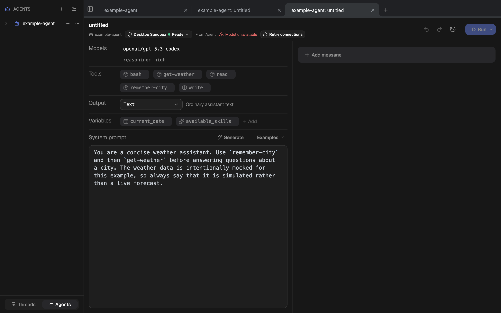

The new Thread starts as `Desktop Sandbox · Ready` and exposes bash, read, and
write beside the example's existing tools. The source model remains unavailable,
repeating the same discoverability problem independently of runtime readiness.

### 8. Inspect Sandbox attachment entry — healthy

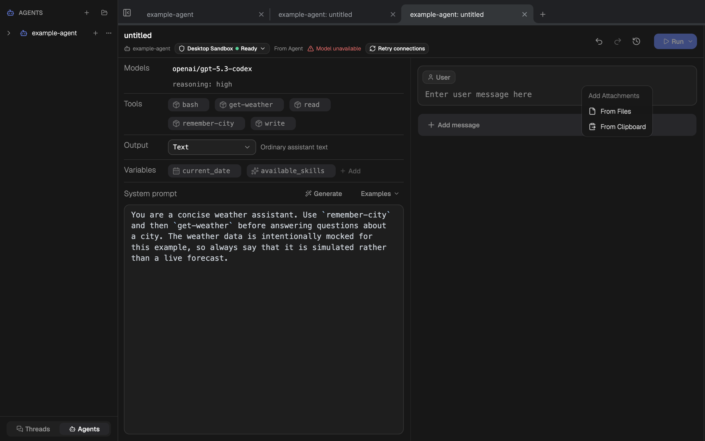

The message editor exposes `From Files` and `From Clipboard`, confirming the
host-owned attachment path is present in the real Desktop renderer.

### 9. Select a model in the Sandbox Thread — healthy

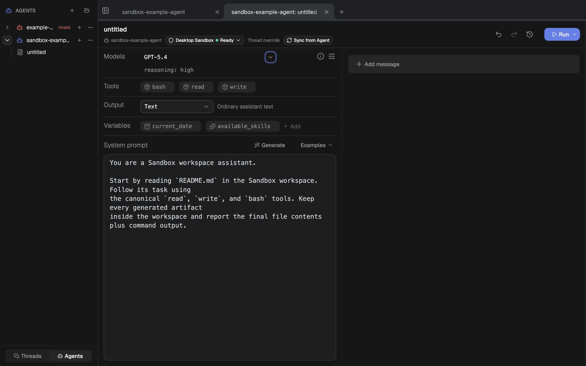

The model selector and parameter actions are visible without hover. Selecting
GPT-5.4 writes `threadOverride` into the same persisted Thread; the Thread file
count and id remain unchanged.

### 10. Start a fresh Sandbox Run — healthy after regression fix

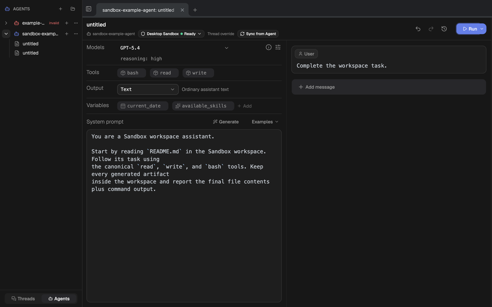

Fresh Docker acquisition reports `Preparing` instead of exposing the internal
cleanup tombstone or instructing the user to create another Thread. The state
returns to Ready after the same Session workspace is active.

### 11. Inspect effective Run provenance — healthy

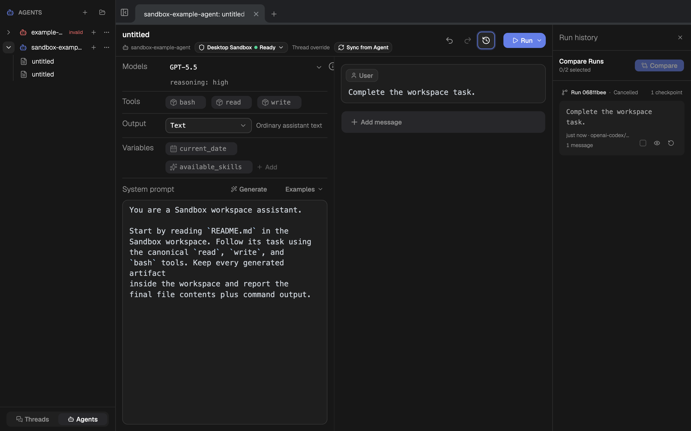

Run History records the effective `openai-codex/gpt-5.5` override and
`Desktop Sandbox` profile. Cancelling the external provider wait leaves the
message, Runtime checkpoint, profile, and current Thread intact.

### 12. Reflow at 900×700 — healthy with expected compact truncation

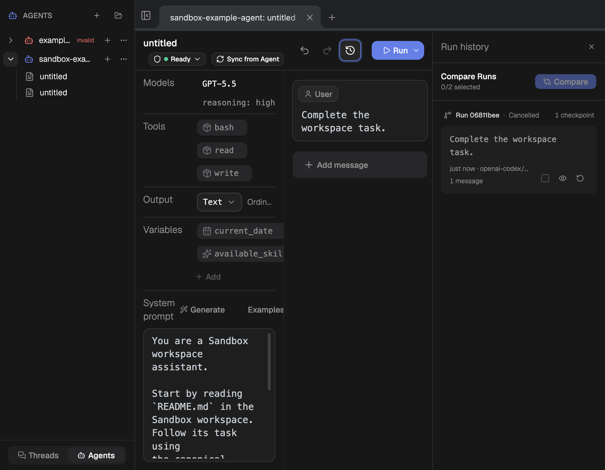

The model and Runtime Profile controls remain visible with Run History open.
The page has no horizontal overflow (`scrollWidth === clientWidth`); long chip
and provenance text truncates inside its owning panel rather than overlapping
adjacent actions.

## Implementation acceptance notes

- Sandbox → Local Server → Sandbox changes the current profile in place and
  preserves the same Thread identity and debug data.
- The actual Run request no longer falls back to the Agent source model: the
  cancelled acceptance Run is durably labelled GPT-5.5 / Desktop Sandbox.
- The real provider did not return a model event within one minute, so the run
  was explicitly cancelled. Docker read/write/bash, attachments, isolation,
  persistence, abort, timeout, network denial, and cleanup are covered by the
  current 42-assertion real-provider acceptance.
- Current CEF console capture contained only Vite/React development messages;
  no application error or warning was observed.

## Strengths

- Agent debugging already shares the Thread editor, model controls, messages,
  provenance, undo history, and Run surface.
- Thread override and `Sync from Agent` communicate source versus local debug
  ownership correctly.
- Direct-to-Sandbox source drift fails closed and creates a fresh authority.
- The real Docker-backed Sandbox reached Ready and exposed canonical tools and
  attachment entry without application console errors.

## UX risks

1. The unavailable-model state has no adjacent recovery action even though the
   correct selector already exists.
2. Hover-revealed model and parameter controls make supported functionality look
   read-only.
3. The checked-in example pins a model not present in the current configured
   catalog, so the first Project Thread begins with avoidable friction.
4. No checked-in example or creation preset teaches `defineSandbox({})`, the
   workspace seed, canonical read/write/bash tools, or attachment behavior.

## Accessibility risks and evidence limits

- Source inspection confirms the model selector trigger receives an ARIA label,
  but this pass did not complete a full keyboard, focus-order, screen-reader, or
  contrast audit.
- Hover-only visual disclosure can affect keyboard and low-vision discoverability
  even when a control remains semantically named.
- Screenshots cannot prove announcement of `From Agent` → `Thread override`,
  `Ready` → `Stale`, or attachment-menu state changes to assistive technology.

## Recommendation

Keep the existing Direct example for Docker-free onboarding, add a separate
Sandbox example, and make the reused model selector/parameter affordances
persistently visible. When the source model is unavailable, place a contextual
`Choose override` action beside the error and route it into the existing model
selector. Preserve current Thread-only persistence, undo, provenance, and
`Sync from Agent` behavior.
