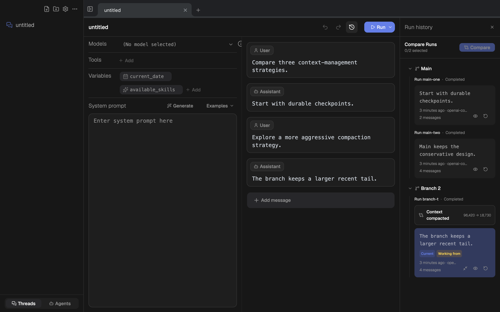
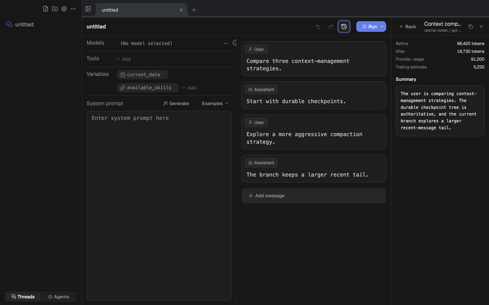
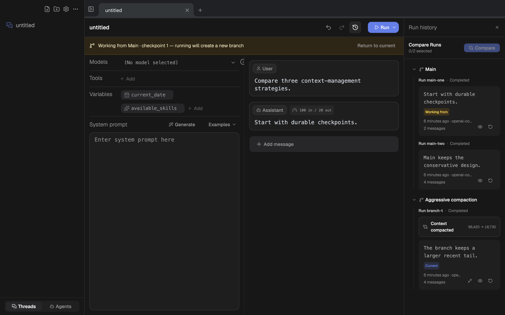
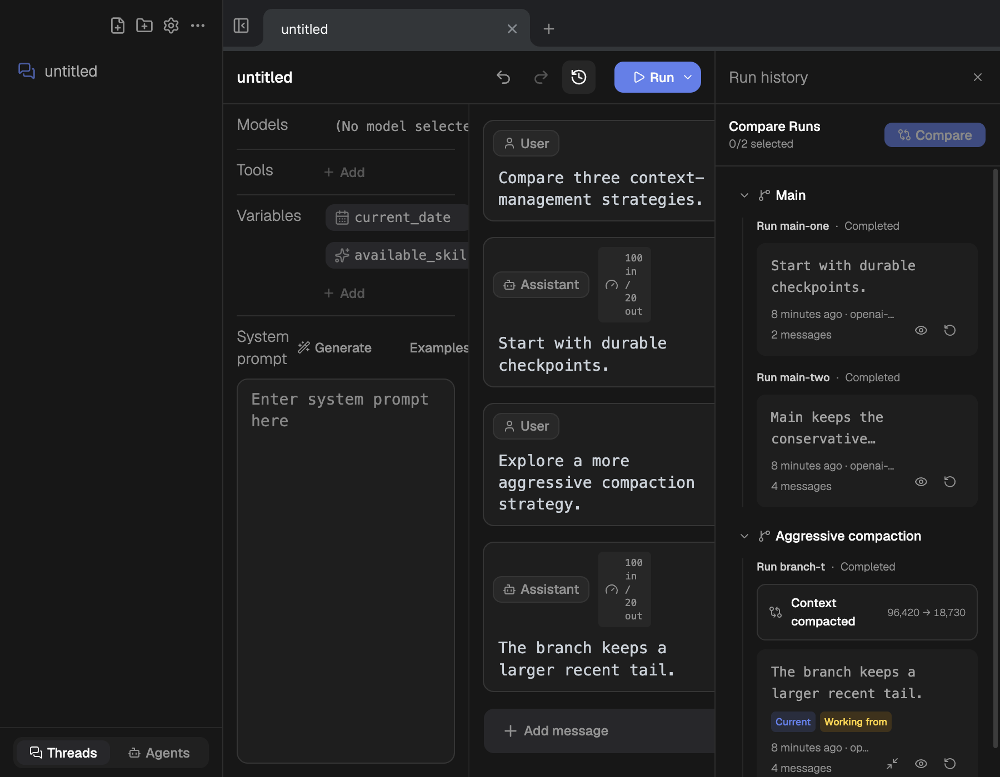
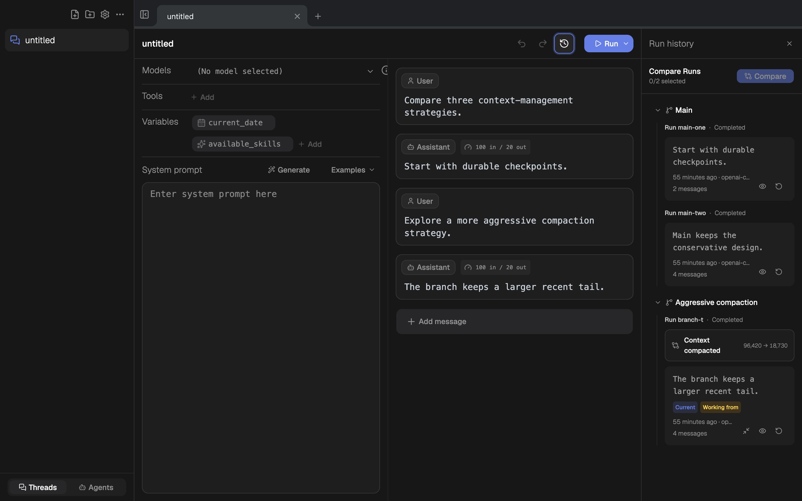
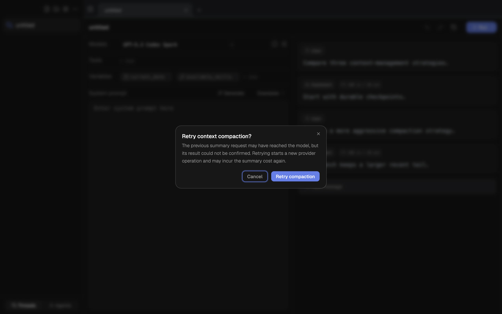
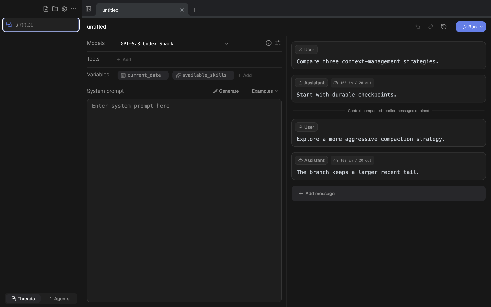
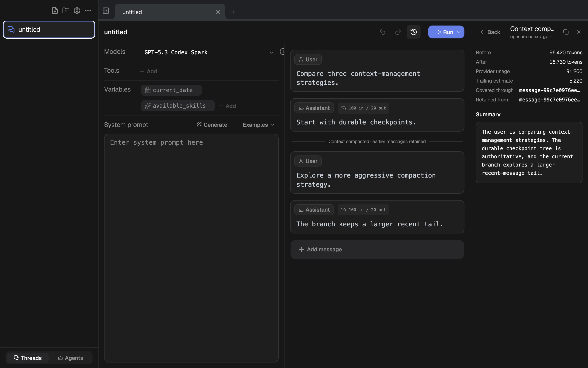

# Runtime history and compaction Desktop audit

## Audit scope

Combined UX and accessibility audit of the Desktop Branch → Run → compaction
workflow in the real Electrobun CEF renderer. The primary viewport was
1280×800; responsive reflow was also checked at 900×700 with CDP device metrics.

## User goal and accessibility target

A user can identify Runtime Current versus Thread Working from, inspect a
compaction without mutating the Thread, restore an older checkpoint with clear
fork consequences, return to Current, rename a branch, and traverse the tree by
keyboard.

## Steps

### 1. Read the branch tree — healthy

- Branch → Run → compaction/checkpoint nesting is legible at 1280×800.
- `Context compacted` is visually distinct from checkpoint cards and carries
  before/after token evidence.
- `Current` and `Working from` remain independent labels. Their initial
  narrow-card overlap was fixed during this audit by moving them to a dedicated
  wrapping row.
- `Compact now` is present in the DOM only for the current settled tip while the
  Thread is also working from that tip.

### 2. Inspect compaction provenance — healthy

- The inspector is read-only and shows the summary, model, before/after tokens,
  provider usage, trailing estimate, covered-through entry, and retained-from
  entry.
- Back and copy actions have accessible names.
- The narrow title/model header truncates visually, while the complete values
  remain present in the DOM. A future tooltip would make pointer discovery
  stronger but is not required for V1 correctness.

### 3. Restore an older checkpoint — healthy

- Restore changes the editable Thread without creating a Run.
- The persistent amber banner clearly states that the next Run will create a
  branch and provides `Return to current`.
- `Current` stays on the Runtime tip while `Working from` moves to the restored
  checkpoint. `Compact now` is hidden in this state after the audit fix.

### 4. Reflow at 900×700 — usable with a known density limit

- The document has no horizontal or vertical page overflow at 900×700.
- Run History remains scrollable and the branch tree, compaction row, status
  labels, and checkpoint actions remain reachable.
- The simultaneous sidebar + two-pane editor + history layout becomes dense:
  variable labels clip and message usage chips wrap awkwardly. This is an
  existing whole-workbench responsive constraint, not a branch-history data or
  interaction failure. A future responsive-layout loop should decide whether
  narrow windows collapse the sidebar/configuration pane or overlay history.

### 5. Final tree re-open at 1280×800 — healthy

- Re-opening Run History after the fixes preserves the Branch → Run hierarchy,
  status labels, scroll reachability, and current-tip action gating.
- The 1280×800 document and body both match the viewport width and height; no
  page overflow is introduced.

### 6. Unknown summary retry — explicit and cost-aware

- Selecting `Compact now` for a terminal unknown summary does not immediately
  create or dispatch a replacement provider operation.
- The confirmation explains that the previous summary may have reached the
  model, retry creates a new provider operation, and the summary cost may be
  incurred again. Cancel remains the initially focused safe action.
- The dialog is fully inside the 1280×800 viewport; document/body dimensions
  remain 1280×800 and the application console contains only Vite/React
  development information.

### 7. Final provenance and keyboard closure — healthy

- The main editable message list places a lightweight `Context compacted`
  marker immediately before the first retained Thread message; it does not
  fabricate a transcript message.
- The inspector exposes both immutable entry identities as `Covered through`
  and `Retained from`, with the full values available in the DOM/title even
  when the narrow panel truncates their visual presentation.
- Dispatching Escape while either Run or compaction inspection is active
  returns to the history tree. The final 1280×800 document remains exactly
  viewport-sized, and the console remains free of application errors.

## Keyboard and semantics

- Confirmed in CEF: Up/Down traverses visible tree nodes; Left moves to the
  branch parent; Right moves to the first child; F2 opens branch rename; Escape
  cancels it; Enter commits a rename.
- Branch rename persisted through the Bun-owned Thread authority.
- Checkpoint, compaction, restore, copy, and compact actions have accessible
  names. Branch headers are focusable but do not expose an explicit tree role or
  expanded state, so screen-reader tree semantics remain a V2 accessibility
  opportunity.

## Evidence limits

- Screenshots cannot prove WCAG contrast ratios or full screen-reader output.
- The explicit compaction provider call was covered by automated Desktop and
  Runtime integration tests rather than spending a real model call in the
  visual fixture.
- Local Server now shares authoritative working-base fork, terminal Session
  projection, and branch-rename semantics, but intentionally does not expose
  `Compact now` in V1.

## Outcome

No critical or high-severity issue remains in the approved V1 flow. The audit
found and fixed two interaction/layout defects plus the missing guarded retry
for an unknown summary outcome. The 900×700 whole-app density and formal ARIA
tree semantics are follow-up opportunities.
