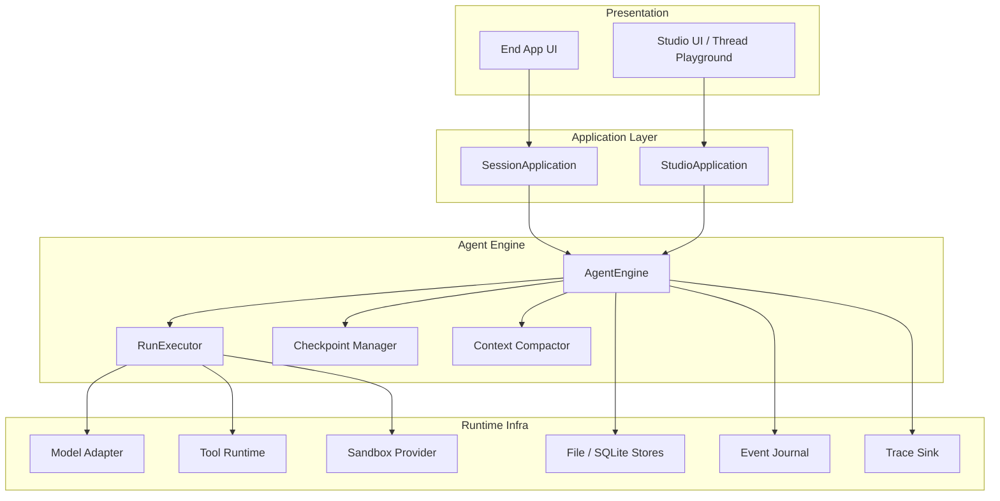
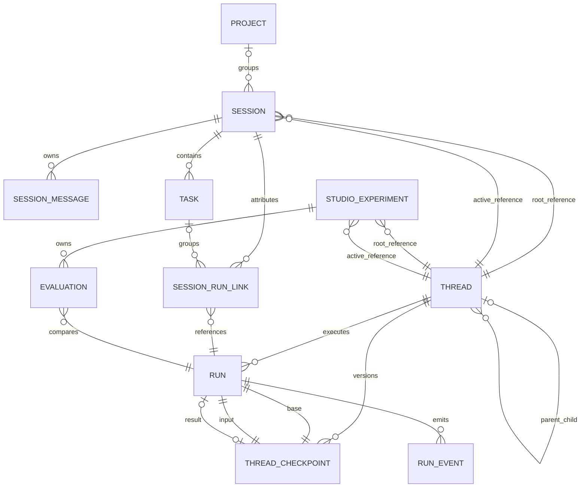
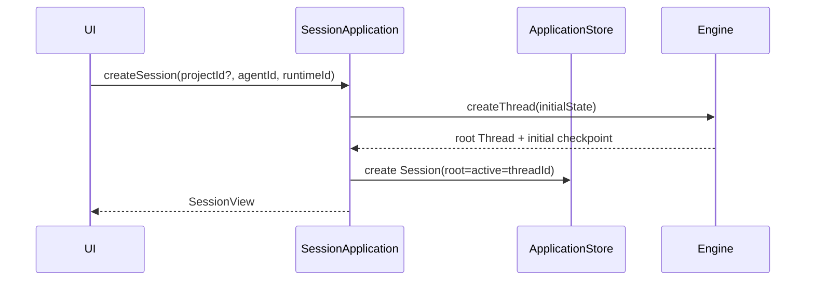
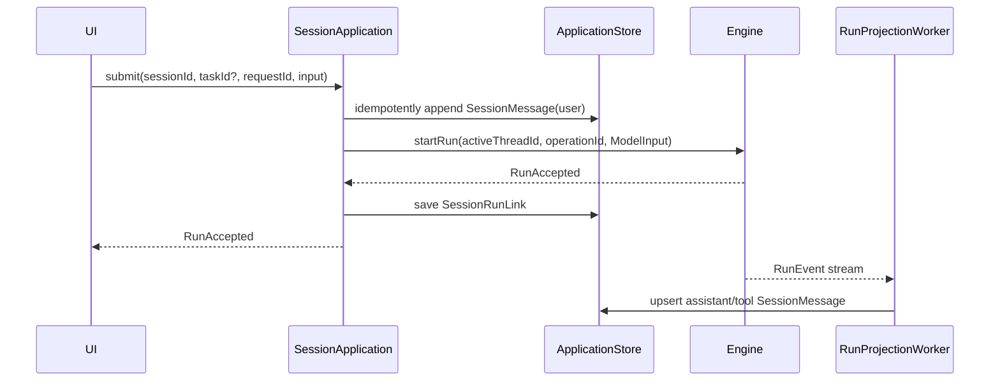
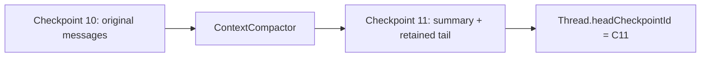
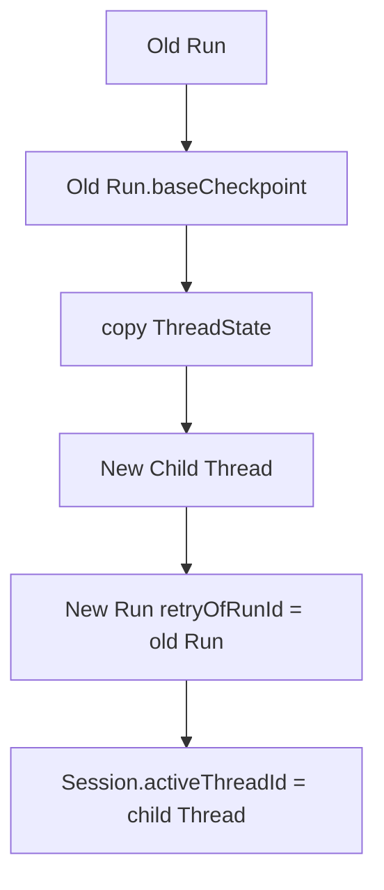
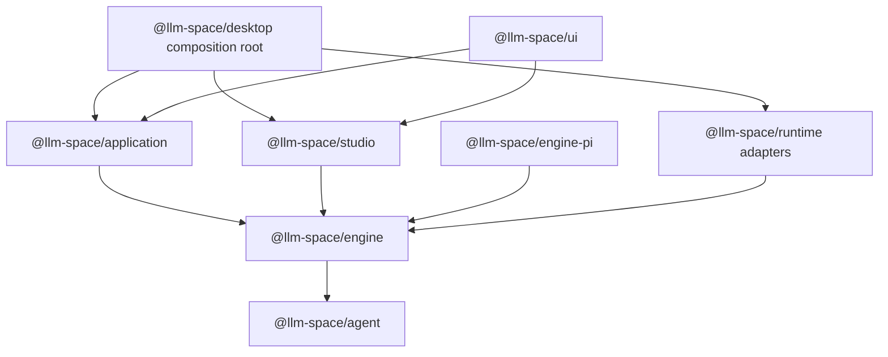

# Agent Application / Studio / Engine 完整架构设计

> 状态：Target Design
>
> 日期：2026-08-10
>
> 范围：结合当前代码，定义未来端应用、现有 Studio、Agent Engine、Runtime Infra、数据存储与流式协议的目标架构。

## 1. 最终结论

系统保留四个核心业务概念：

```text
Session / Thread / Task / Run
```

但它们不属于同一层：

```text
Application
  Project? -> Session -> SessionMessage*
                       -> Task* -> Run reference*

Agent Engine
  Thread -> Checkpoint* -> ThreadState
  Thread -> Run*
  Thread -> Child Thread*
```

最重要的设计决策如下。

1. `Session` 是端应用的稳定工作入口；`Thread` 是 Agent 可继续执行的状态身份，二者不能混用。
2. `SessionMessage` 是完整产品时间线，不受模型上下文压缩影响。
3. `ModelMessage` 不建独立表，只存在于 `ThreadCheckpoint.threadState.messages` 中。
4. `ThreadState.messages` 就是当前模型工作上下文，允许被 compaction 替换、压缩和裁剪；它不是完整 transcript。
5. `ThreadState` 还包含 Agent 自定义 `state`，两部分必须在同一个 checkpoint 中原子保存。
6. `Thread` 自身只保存 identity、树关系和 head checkpoint 指针，不再复制一份当前 document/state。
7. `Run` 是 Thread 上的一次执行尝试；一个 Run 可以包含多个模型步骤和工具步骤。
8. Resume 使用同一个 Thread；Retry 从原 Run 的 base checkpoint 创建 Child Thread 和新 Run；Handoff 创建新的 Session 和新的 Root Thread，并复制状态。
9. `Harness` 不是领域实体，也不应继续作为顶层包名；它的执行行为收敛为 `AgentEngine`。
10. 当前 Studio 和未来端应用是 Engine 上面的两个不同 Application Module：它们共享执行能力，但不共享产品数据模型。

目标产品信息架构仍然可以保持简单：

```text
Project? -> Session
```

`Project` 是可选组织和资源范围，不进入 Agent Engine。

## 2. 当前代码的真实形状

当前仓库已经实现了很多可复用能力，但存在三套重叠的数据模型和两条执行链路。

### 2.1 当前两条执行链

```mermaid
flowchart TD
  subgraph Legacy["现有 Playground 直连链路"]
    UIStore["ThreadStore (Zustand)"] --> CoreStream["core.streamThread()"]
    CoreStream --> RuntimeStream["Runtime StreamThreadController"]
    RuntimeStream --> PiLoop["pi agentLoopContinue()"]
    PiLoop --> Reducer["core.reduceMessages()"]
    Reducer --> UIStore
  end

  subgraph Studio["现有 Project Studio 链路"]
    StudioUI["Project UI + ThreadPlayground"] --> StudioAdapter["ExternalThreadExecutionRuntime"]
    StudioAdapter --> RPC["ProjectStudioTransport / Electrobun RPC"]
    RPC --> StudioRuntime["StudioThreadRuntime"]
    StudioRuntime --> RunExecutor["ModelRunExecutor"]
    RunExecutor --> PiAdapter["PiModelTurnEngine"]
  end
```



第一条链路由 UI Store 负责模型循环、工具执行、消息归并和 Run History；第二条链路由 Bun 进程中的 `StudioThreadRuntime` 负责 Run、checkpoint、事件和恢复。二者对“谁拥有执行状态”的答案不同。

### 2.2 当前三套重叠模型

| 当前模型 | 代码位置 | 实际语义 | 主要问题 |
| --- | --- | --- | --- |
| `HarnessSessionSnapshot` | `packages/harness/src/session/protocol.ts` | Session/Turn 状态机，同时保存 messages/state | 把应用 Session 和 Agent Thread 合在一起 |
| `StudioThread` / `Conversation` | `packages/harness/src/studio/*`、`conversation/*` | Studio 可编辑文档、当前执行状态和 Run owner | Thread 同时承担 Studio 文档与 Engine 状态 |
| `core.Thread` | `packages/core/src/types/threads/thread.ts` | Playground 文件格式，含 prompt、tools、messages、runHistory、evaluation | 名称像 Engine Thread，实际是 UI/Studio 文档 |

目标架构不会继续维护三套相互转换的“Thread”。

### 2.3 可以直接复用的实现

| 状态 | 当前能力 | 代码位置 | 目标去向 |
| --- | --- | --- | --- |
| 已实现 | Code-first Agent 定义与 loader | `packages/agent` | 保留为 `@llm-space/agent` |
| 已实现 | 单次模型调用 seam 与 Pi Adapter | `packages/harness/src/execution/model-engine.ts`、`packages/harness-pi` | 移入 `@llm-space/engine`、重命名为 `@llm-space/engine-pi` |
| 已实现 | 外层模型/工具循环与 schema 校验 | `packages/harness/src/execution/run-executor.ts` | 作为 Engine 内部 Run Executor |
| 已实现 | Run 基本状态与 Repository | `packages/harness/src/run` | 收敛为 Thread-owned Run |
| 部分实现 | Thread、fork、Run、checkpoint、恢复 | `packages/harness/src/studio` | 作为新 Engine 的主要实现基线 |
| 已实现 | 文件与内存 Repository、JSONL Event Log | `packages/harness/src/storage` | 适配新的 Engine Store interface |
| 已实现 | Project source revision pinning | `apps/desktop/src/bun/projects` | 保留在 Studio Application，不进入 Engine 核心 |
| 已实现 | Studio RPC streaming | `apps/desktop/src/client/rpc-project-studio-client.ts` | 适配统一 Run Stream 协议 |
| 已实现 | Playground 编辑、Run History、Evaluation UI | `packages/ui/src/components/thread-playground` | 保留为 Studio UI，并改为消费 StudioGateway |
| 已实现 | Model、MCP、Skills、Tool、Network、Trace 等能力 | `packages/runtime` | 作为 Engine 的 Infra Adapter，不拥有 Thread 生命周期 |

### 2.4 必须调整的当前实现

1. `HarnessSessionSnapshot` 与 `StudioThreadRuntime` 是两套竞争的执行状态机，只保留一套 `AgentEngine -> Thread/Run/Checkpoint`。
2. 当前 `StudioThread.document` 保存可变 conversation，同时 checkpoint 又保存 document，形成两个当前状态来源。
3. 当前 checkpoint 只在 Run 成功结束时创建，没有 `parentCheckpointId`，Thread 也没有 `headCheckpointId`。
4. 当前 `run(fromMessageId)` 在同一个 StudioThread 中 slice messages，属于原地改写，不符合 Retry 分支语义。
5. 当前 `RunOwner` 支持 `session | thread`，目标中 Run 只属于 Thread。
6. 当前 `Conversation.state` 只是数据字段；`defineState()` 的 AsyncLocalStorage 尚未接入 Run Executor 和 checkpoint。
7. 当前 Agent compaction 只有定义字段，尚未改变 Engine 的 ThreadState。
8. 当前 Studio event 以 Thread 为 stream scope；目标以 Run 为 scope，并支持 snapshot + cursor replay。
9. 当前 `ToolContext.session`、`SessionTurn` 把应用术语泄漏进 Agent；目标改为 Thread/Run execution context。
10. 当前 `RuntimeClient` 同时暴露大量 capability 和原始 `streamThread`；目标应用和 Studio 不再直接驱动 raw model stream。
11. 当前 Harness `Conversation -> HarnessMessage` 转换会把富内容降级为字符串；新 Engine 必须合并 core 直连链路已有的 image、thinking、tool 和 provider event 表达，不能为了复用 RunExecutor 丢失能力。

## 3. 分层与 Module 边界

### 3.1 目标分层



### 3.2 各层所有权

| 层 | 拥有 | 不拥有 |
| --- | --- | --- |
| End App UI | 查询缓存、Run stream overlay、输入框和选中态 | Session/Task/Thread 的事实状态 |
| SessionApplication | Project?、Session、SessionMessage、Task、Session 与 Run 的关联 | ModelMessage、checkpoint、模型/工具循环 |
| StudioApplication | Studio Experiment、Agent Draft、source revision、Run 排序、Evaluation | SessionMessage、Task、Engine 当前状态 |
| AgentEngine | Thread、ThreadCheckpoint、ThreadState、Run、RunEvent | Project、Session、Task、UI 时间线 |
| Runtime Infra | 模型、工具、MCP、Skill、Sandbox、网络、持久化 Adapter | Session/Thread/Task/Run 的业务决策 |

SessionApplication 和 StudioApplication 是两个不同的深 Module：

- SessionApplication 隐藏产品时间线、Task 状态和 Engine 投影逻辑。
- StudioApplication 隐藏可编辑 Agent Draft、source revision、manual checkpoint、Run History 和 Evaluation 逻辑。
- UI 不直接跨过它们操作 Repository 或 Engine Store。

## 4. 四个核心概念

### 4.1 Session

Session 是未来端应用的稳定 UI identity。

```ts
export interface Session {
  readonly id: string;
  readonly projectId?: string;
  readonly runtimeId: string;

  readonly rootThreadId: string;
  readonly activeThreadId: string;

  readonly agentId: string;
  readonly title: string;
  readonly status: "active" | "archived";

  readonly createdAt: number;
  readonly updatedAt: number;
}
```

不变量：

- `rootThreadId` 创建后不变。
- `activeThreadId` 初始等于 root，Retry 后可以指向同一 Thread Tree 的 Child Thread。
- Session 不表示进程、网络连接、sandbox 或一次模型调用。
- 关闭应用、重新打开、继续输入，仍然是同一个 Session。
- Session 所属 Engine 由 `runtimeId` 路由；Thread 本身不感知 Session。

这里的可选 Application `Project` 与当前 Studio 的 Agent Project 不是同一个对象：前者用于组织用户 Session，后者是 Agent 源码、工作目录和 source revision 的开发范围，目标命名为 `StudioProject`。

### 4.2 Thread

Thread 是 Agent 可继续执行的状态 identity。

```ts
export interface Thread {
  readonly schemaVersion: 1;
  readonly id: string;
  readonly rootThreadId: string;

  readonly parentThreadId?: string;
  readonly forkedFromCheckpointId?: string;
  readonly copiedFrom?: {
    readonly runtimeId: string;
    readonly threadId: string;
    readonly checkpointId: string;
  };

  readonly headCheckpointId: string;
  readonly activeRunId?: string;
  readonly revision: number;

  readonly createdAt: number;
  readonly updatedAt: number;
}
```

Thread 不直接保存一份可变的 messages/state。当前状态只通过以下方式读取：

```text
Thread.currentState = load(Thread.headCheckpointId).threadState
```

`activeRunId` 是单 writer 约束的一部分，必须与 Run 创建/终止和 `revision` 在同一事务或原子文件更新中维护。

### 4.3 Task

Task 是 Session 中可选的工作目标，不是每次聊天输入都必须创建的对象。

```ts
export interface Task {
  readonly id: string;
  readonly sessionId: string;
  readonly goal: string;
  readonly inputSessionMessageId?: string;

  readonly status:
    | "pending"
    | "running"
    | "waiting"
    | "completed"
    | "failed"
    | "cancelled";

  readonly latestRunId?: string;
  readonly selectedRunId?: string;

  readonly createdAt: number;
  readonly updatedAt: number;
  readonly completedAt?: number;
}
```

Task 的多次 attempt 直接由多个 Run 表示，不增加 `TaskAttempt` 实体。

普通对话可以是：

```text
Session -> Run
```

有明确工作目标、重试、调度或结果选择时才需要：

```text
Session -> Task -> Run*
```

### 4.4 Run

Run 是推动一个 Thread 从某个 checkpoint 向后执行的一次 attempt。

```ts
export interface Run {
  readonly schemaVersion: 1;
  readonly id: string;
  readonly threadId: string;
  readonly operationId: string;

  readonly retryOfRunId?: string;
  readonly triggerMessageId: string;
  readonly baseCheckpointId: string;
  readonly inputCheckpointId: string;
  readonly resultCheckpointId?: string;

  readonly agentSnapshot: AgentSnapshot;

  readonly status:
    | "queued"
    | "running"
    | "waiting"
    | "completed"
    | "failed"
    | "cancelled";

  readonly usage?: TokenUsage;
  readonly error?: RunError;

  readonly createdAt: number;
  readonly startedAt?: number;
  readonly completedAt?: number;
}
```

不变量：

- Run 永远只属于一个 Thread，不拥有 `sessionId` 或 `taskId`。
- 一个 Thread 可以先后执行多个 Run，但默认只允许一个 active writer Run。
- Run 创建后，其 `baseCheckpointId`、`inputCheckpointId`、`agentSnapshot` 和 `retryOfRunId` 不变。
- Application 通过内部 `SessionRunLink` 把 Run 归属到 Session/Task。

## 5. ThreadState、Checkpoint 与消息

### 5.1 ThreadState

```ts
export interface ThreadState {
  /** 当前模型工作上下文；会被 compaction 替换、压缩或裁剪。 */
  readonly messages: readonly ModelMessage[];

  /** Agent 自定义且需要跨 Run 恢复的状态。 */
  readonly state: Readonly<Record<string, JsonValue>>;
}
```

这里必须明确：

```text
ThreadState.messages != 完整历史
ThreadState.messages == 当前可继续运行的模型上下文
```

它可以从：

```text
[system, user-1, assistant-1, tool-1, user-2]
```

压缩为：

```text
[system, compaction-summary, user-2]
```

压缩后的 head checkpoint 不再包含 `user-1 / assistant-1 / tool-1` 原消息。完整产品历史由 SessionMessage 保存。

### 5.2 ThreadCheckpoint

```ts
export interface ThreadCheckpoint {
  readonly schemaVersion: 1;
  readonly id: string;
  readonly threadId: string;
  readonly parentCheckpointId?: string;
  readonly sequence: number;

  readonly source:
    | { readonly type: "thread.created" }
    | {
        readonly type: "thread.forked";
        readonly sourceThreadId: string;
        readonly sourceCheckpointId: string;
      }
    | {
        readonly type: "thread.copied";
        readonly sourceRuntimeId: string;
        readonly sourceThreadId: string;
        readonly sourceCheckpointId: string;
      }
    | { readonly type: "run.input"; readonly runId: string }
    | { readonly type: "run.step"; readonly runId: string }
    | { readonly type: "compaction"; readonly runId?: string }
    | { readonly type: "studio.manual" };

  readonly threadState: ThreadState;
  readonly createdAt: number;
}
```

Checkpoint 是 immutable snapshot。创建新 checkpoint 后通过 compare-and-swap 更新 `Thread.headCheckpointId`，不原地改写旧 checkpoint。

逻辑上 Child Thread 会复制来源 checkpoint 的 `ThreadState`，再在 Child Thread 内创建自己的初始 checkpoint：

```text
Parent checkpoint P7
        |
        | copy ThreadState
        v
Child checkpoint C1
```

存储 Adapter 可以使用 content-addressed blob 或 copy-on-write 降低物理复制成本，但领域语义仍然是 copy，不是两个 Thread 共同拥有同一个可变 checkpoint。

### 5.3 ModelMessage

`ModelMessage` 是 ThreadState 的内部值对象，不单独建表：

```ts
export type ModelMessage =
  | ModelSystemMessage
  | ModelUserMessage
  | ModelAssistantMessage
  | ModelToolMessage;

export interface ModelMessageBase {
  readonly id: string;
  readonly runId?: string;
  readonly source?: {
    readonly type: "application" | "studio" | "engine";
    readonly externalMessageId?: string;
  };
  readonly createdAt: number;
}
```

模型消息 ID 在被压缩前保持稳定；compaction summary 是一条新的 ModelMessage。已经被 summary 覆盖的旧 ModelMessage 不要求继续存在于当前 ThreadState。

ModelMessage 的 canonical schema 应复用 `@llm-space/core` 已有的 content/tool value objects，支持文本、图片、thinking、tool call/result 和必要的 provider-hosted activity。Model Adapter 负责 provider 类型转换，Engine 不把消息降级成单一字符串，也不把 provider 原始 payload 直接暴露给 Application。

### 5.4 SessionMessage

SessionMessage 属于 Application Store：

```ts
export interface SessionMessage {
  readonly id: string;
  readonly sessionId: string;
  readonly sequence: number;
  readonly clientRequestId?: string;
  readonly taskId?: string;
  readonly runId?: string;

  readonly kind:
    | "user"
    | "assistant"
    | "tool"
    | "userAction"
    | "systemNotice";

  readonly source:
    | { readonly type: "application" }
    | {
        readonly type: "thread";
        readonly runtimeId: string;
        readonly threadId: string;
        readonly modelMessageId: string;
      };

  readonly status: "streaming" | "completed" | "interrupted";
  readonly version: number;
  readonly content: readonly SessionContentPart[];

  readonly createdAt: number;
  readonly completedAt?: number;
}
```

两类消息的边界是：

| | SessionMessage | ModelMessage |
| --- | --- | --- |
| Owner | SessionApplication | ThreadCheckpoint |
| 用途 | UI、分享、搜索、审计 | 下一步模型交互与 Agent 恢复 |
| 完整性 | 完整时间线 | 允许压缩和裁剪 |
| 存储 | Application Store 独立记录 | checkpoint JSON/blob 内嵌 |
| UI 行为/产品通知 | 保存 | 不保存 |
| system prompt/内部工具消息 | 通常不保存 | 可以保存 |

没有 `model_messages` 表，也没有 `SessionMessage + ModelMessage` 共表设计。

## 6. 完整 ER 关系



跨 Application Store、Studio Store 和 Engine Store 的关系是逻辑引用；当 Engine 位于 remote runtime 时，不要求数据库外键。

### 6.1 Internal link objects

`SessionRunLink` 不是新的核心概念，只是 Application 的归属记录：

```ts
interface SessionRunLink {
  readonly sessionId: string;
  readonly runId: string;
  readonly taskId?: string;
  readonly runtimeId: string;
  readonly threadId: string;
  readonly relation: "submitted" | "retried" | "continued";
  readonly lastKnownStatus: Run["status"];
  readonly createdAt: number;
}
```

Studio 使用补充对象 `StudioExperiment`，避免继续把 Studio 文档叫做 Thread：

```ts
interface StudioExperiment {
  readonly id: string;
  readonly projectId: string;
  readonly runtimeId: string;
  readonly title: string;
  readonly rootThreadId: string;
  readonly activeThreadId: string;
  readonly sourceRevision: string;
  readonly draft: StudioAgentDraft;
  readonly runOrder: readonly string[];
  readonly createdAt: number;
  readonly updatedAt: number;
}
```

`StudioExperiment` 是 Studio 专用 Application 对象，不是第五个通用 Agent 核心对象。

## 7. 生命周期与状态转换

### 7.1 创建 Session



创建过程中使用 `clientRequestId` 或 host operation id 保证重试不会产生多个 Root Thread。V1 同进程 Adapter 可以使用补偿删除处理中间失败；如果 Application 与 Engine 未来跨服务部署，再增加 outbox，不提前引入分布式事务模型。

### 7.2 普通提交与 Continue



Continue 和重新打开 Session 后再提交都使用 `Session.activeThreadId`，不创建新 Thread。

### 7.3 Engine 内部 Run

```text
1. 读取 Thread.headCheckpoint
2. 校验 expectedHeadCheckpointId / Thread.revision
3. 创建 Run(baseCheckpointId = old head)
4. 把本次输入加入 ThreadState.messages
5. 创建 run.input checkpoint
6. 原子设置 Thread.headCheckpointId、activeRunId 和 Run queued
7. Worker 执行模型/工具循环
8. 每个安全边界提交 run.step 或 compaction checkpoint
9. terminal 时更新 Run.resultCheckpointId、status，并清空 activeRunId
```

安全边界包括：

- 用户输入已持久化；
- 完整 assistant message 已结束；
- tool result 已完成；
- Agent state 已更新；
- compaction 已完成。

未完成的 token delta 可以出现在 stream snapshot 中，但不能作为可恢复 ModelMessage 写进 head checkpoint。

### 7.4 Compaction

Compaction 是 ThreadState 的状态转换，不是 UI transcript 操作：



- SessionMessage 不改、不删。
- Task/Run 归属不变。
- Studio 调试页可以显示发生过 compaction，但默认读取压缩后的 head state。
- 旧 checkpoint 是否长期保留由 retention policy 决定，不能把 checkpoint archive 当产品完整历史。
- 被 Run 的 `base/input/resultCheckpointId` 引用的 checkpoint 在 Run 保留期间不得 GC。

### 7.5 Resume

Resume 没有新实体，也不需要 `ExecutionSession`：

```text
load same Thread
  -> load head checkpoint
  -> create new Run when next input arrives
```

进程重启只改变 Engine worker 生命周期，不改变 Thread ID。

### 7.6 Task Retry

Retry 不修改旧 Run，也不在旧 Thread 上原地截断消息：



完整步骤：

1. Engine 读取旧 Run 的 base checkpoint 和 input checkpoint。
2. Engine 从 base checkpoint 复制 state，创建 Child Thread 初始 checkpoint。
3. Engine 重放旧 Run 的触发输入，创建新 Run 和 input checkpoint。
4. Application 新增 `SessionRunLink(relation="retried")`。
5. Task 从 `failed` 回到 `running`，`latestRunId` 指向新 Run。
6. 新 Run 成功后，`selectedRunId` 可以指向新 Run。
7. Session 时间线追加 Retry 用户行为和新输出；旧输出不删除，UI 可按 Run 关系标记为 superseded。

### 7.7 Handoff

Handoff 是复制，不是 resume，也不是把一个 Thread 同时交给多个 Session：

```text
Source Session + Source Root Thread
        |
        | copy selected checkpoint state
        v
New Session + New Root Thread
```

- 来源 Session/Thread 保持不变。
- 新 Root Thread 可以记录 `copiedFrom` provenance。
- 跨 runtime handoff 通过导出/导入序列化 ThreadState 完成；不会共享可变 checkpoint。

### 7.8 Cancel、失败与恢复

- Cancel/Failure 终止 Run，不删除已提交 checkpoint。
- Thread head 保持在最后一个安全 checkpoint。
- 不完整 assistant delta 只作为 interrupted SessionMessage/stream draft 展示，不进入可恢复 ModelMessage。
- Engine 重启发现 `activeRunId` 对应的 worker 不存在时，将 Run 标记 cancelled 或 interrupted-recovered，并清除 writer lock。
- 用户随后 Continue 仍在同一个 Thread；Retry 则从旧 Run base checkpoint 创建 Child Thread。

## 8. Agent Engine Interface

`AgentEngine` 是内部执行 seam。它隐藏 Repository、worker、锁、checkpoint 和模型/工具循环：

```ts
export interface AgentEngine {
  createThread(input: CreateThreadInput): Promise<ThreadView>;
  getThread(threadId: string): Promise<ThreadView | undefined>;

  checkpointThread(input: CheckpointThreadInput): Promise<ThreadView>;
  forkThread(input: ForkThreadInput): Promise<ThreadView>;

  startRun(input: StartRunInput): Promise<RunAccepted>;
  retryRun(input: RetryRunInput): Promise<RunAccepted>;
  getRun(runId: string): Promise<Run | undefined>;
  listRuns(threadId: string): Promise<readonly Run[]>;

  watchRun(input: WatchRunInput): AsyncIterable<EngineRunFrame>;
  interruptRun(runId: string): Promise<void>;
}
```

其中：

```ts
export interface ThreadView {
  readonly thread: Thread;
  readonly checkpoint: ThreadCheckpoint;
}

export interface StartRunInput {
  readonly operationId: string;
  readonly threadId: string;
  readonly expectedHeadCheckpointId?: string;
  readonly input: ModelInput;
  readonly agent: AgentExecutionRef;
}

export interface RetryRunInput {
  readonly operationId: string;
  readonly runId: string;
  readonly agent?: AgentExecutionRef;
}
```

`checkpointThread()` 是 Studio 的受控编辑能力：只允许在无 active Run 且 `expectedHeadCheckpointId` 匹配时创建 `studio.manual` checkpoint。未来端应用通常不调用它。

### 8.1 Agent snapshot

每个 Run 保存可序列化 AgentSnapshot，用于可复现和审计：

```ts
export interface AgentSnapshot {
  readonly schemaVersion: 1;
  readonly agentId: string;
  readonly generationId: string;
  readonly sourceRevision?: string;
  readonly model: AgentModelDefinition;
  readonly instructions: readonly string[];
  readonly tools: readonly ModelToolDefinition[];
  readonly compaction?: AgentCompactionDefinition;
  readonly limits?: AgentLimitsDefinition;
}
```

可执行 tool function 不序列化，由 `AgentResolver` 根据 snapshot/fingerprint 解析。当前 `resolveAgentGeneration()` 需要补齐 compaction、limits、dynamic feature 支持状态，而不是只保存 model/instructions/tools。

## 9. 统一 Run 流式协议

### 9.1 Engine stream

```ts
export type EngineRunFrame =
  | {
      readonly type: "snapshot";
      readonly cursor: number;
      readonly run: Run;
      readonly outputs: readonly ModelOutputSnapshot[];
      readonly headCheckpointId: string;
    }
  | {
      readonly type: "event";
      readonly cursor: number;
      readonly event: EngineRunEvent;
    };

export type EngineRunEvent =
  | { readonly type: "run.updated"; readonly run: Run }
  | { readonly type: "message.started"; readonly message: ModelMessage }
  | {
      readonly type: "message.delta";
      readonly messageId: string;
      readonly delta: ModelContentDelta;
    }
  | { readonly type: "message.completed"; readonly message: ModelMessage }
  | { readonly type: "tool.started"; readonly call: ModelToolCall }
  | { readonly type: "tool.completed"; readonly result: ModelToolResult }
  | {
      readonly type: "checkpoint.committed";
      readonly checkpointId: string;
      readonly reason: "input" | "step" | "compaction";
    };
```

协议保证：

1. 第一帧一定是 snapshot。
2. 后续 event 的 cursor 严格递增。
3. 重连时客户端传 `afterCursor`；snapshot 与后续 event 之间无竞态空洞。
4. terminal Run 的 snapshot 后可以立即关闭。
5. 重复帧可按 cursor 丢弃。
6. stream 断开不等于 Run failed。

`outputs` 同时包含 completed output 和 in-flight draft。RunProjectionWorker 即使在 Run 结束后才启动，也能从 snapshot 幂等补齐 SessionMessage；Event Journal 在对应 Application projection cursor 推进前不得回收这些输出证据。

### 9.2 Application stream

SessionApplication 不把 ModelMessage 直接暴露给 UI，而是映射成 Session DTO：

```ts
export type SessionRunFrame =
  | {
      readonly type: "snapshot";
      readonly cursor: number;
      readonly run: RunSummary;
      readonly messages: readonly SessionMessage[];
    }
  | {
      readonly type: "event";
      readonly cursor: number;
      readonly event: SessionRunEvent;
    };

export type SessionRunEvent =
  | { readonly type: "run.updated"; readonly run: RunSummary }
  | { readonly type: "sessionMessage.started"; readonly message: SessionMessage }
  | {
      readonly type: "sessionMessage.delta";
      readonly messageId: string;
      readonly version: number;
      readonly delta: SessionContentDelta;
    }
  | {
      readonly type: "sessionMessage.completed";
      readonly message: SessionMessage;
    }
  | { readonly type: "task.updated"; readonly task: Task };
```

Electrobun 继续使用 fire-and-forget message 模拟 stream；Remote Adapter 可以用 SSE/WebSocket。传输方式不同，但都实现相同 Frame interface。

## 10. UI 与 Application 协议

### 10.1 End App SessionGateway

UI 只学习一个 SessionGateway interface：

```ts
export interface SessionGateway {
  listSessions(input: ListSessionsInput): Promise<Page<SessionSummary>>;
  getSession(input: GetSessionInput): Promise<SessionView>;

  createSession(input: CreateSessionInput): Promise<SessionView>;
  createTask(input: CreateTaskInput): Promise<Task>;
  submit(input: SubmitInput): Promise<RunAcceptedDTO>;
  retryTask(input: RetryTaskInput): Promise<RunAcceptedDTO>;
  handoffSession(input: HandoffSessionInput): Promise<SessionView>;

  interruptRun(runId: string): Promise<void>;
  watchRun(input: WatchSessionRunInput): AsyncIterable<SessionRunFrame>;
}
```

UI 不需要依次调用：

```text
appendSessionMessage()
createThreadMessage()
createRun()
linkTaskRun()
startProjector()
```

这些细节全部由 SessionApplication 隐藏。

### 10.2 SessionView

```ts
export interface SessionView {
  readonly session: Session;
  readonly messages: Page<SessionMessage>;
  readonly tasks: readonly TaskView[];
  readonly activeRuns: readonly RunSummary[];
}

export interface TaskView {
  readonly task: Task;
  readonly runs: readonly RunSummary[];
}
```

`getSession()` 默认只查 Application Store：Session、SessionMessage、Task 和 Run status projection。它不读取 ThreadCheckpoint，也不需要反序列化模型上下文。

需要调试模型上下文时，使用单独的 Engine/Studio debug query，不扩大普通 SessionView。

### 10.3 End App UI 状态

```ts
interface SessionPageState {
  query: SessionView;
  runOverlays: Map<string, SessionRunOverlay>;
  composerDraft: UserInputDraft;
  selectedTaskId?: string;
  connection: "connected" | "reconnecting" | "offline";
}
```

消费规则：

1. 打开页面通过 `getSession()` 取得 durable snapshot。
2. 提交成功后把 user SessionMessage 放入查询缓存，并为 Run 创建 overlay。
3. `watchRun()` 的 snapshot 整体替换该 Run overlay。
4. event 按 cursor/version 折叠。
5. terminal 后重新 `getSession()`，用 Store 数据替换 overlay。
6. UI 不把 streaming draft 当作已经 checkpoint 的 ThreadState。

## 11. Studio Application 与现有 Studio 能力

Studio 不需要 SessionMessage；它直接围绕“可编辑 Agent Draft + Engine Thread 当前状态 + Run 候选结果”工作。

### 11.1 StudioGateway

```ts
export interface StudioGateway {
  listExperiments(): Promise<readonly StudioExperimentSummary[]>;
  createExperiment(input: CreateStudioExperimentInput): Promise<StudioView>;
  getExperiment(experimentId: string): Promise<StudioView | undefined>;

  saveDraft(input: SaveStudioDraftInput): Promise<StudioView>;
  saveThreadState(input: SaveStudioThreadStateInput): Promise<StudioView>;

  run(input: StartStudioRunInput): Promise<RunAcceptedDTO>;
  retryRun(input: RetryStudioRunInput): Promise<RunAcceptedDTO>;
  forkExperiment(input: ForkStudioExperimentInput): Promise<StudioView>;
  interruptRun(runId: string): Promise<void>;
  watchRun(input: WatchRunInput): AsyncIterable<StudioRunFrame>;

  saveRunOrder(input: SaveStudioRunOrderInput): Promise<StudioView>;
  saveEvaluationMetadata(
    input: SaveStudioEvaluationInput
  ): Promise<StudioView>;
}
```

### 11.2 StudioView 组装

```text
Studio Store
  StudioExperiment
  Agent Draft
  Run order
  Evaluations/Rubrics
          +
Engine Store
  active Thread
  head checkpoint -> ThreadState.messages/state
  Runs -> result checkpoints
          =
StudioView / PlaygroundDocument
```

当前 `project-thread-adapter.ts` 的转换 seam 可以保留，但目标类型改为：

```text
StudioView <-> PlaygroundDocument
```

而不是：

```text
StudioThread <-> core.Thread
```

### 11.3 Studio 编辑语义

- 编辑 title/model/instructions/tools：保存到 `StudioExperiment.draft`。
- 编辑当前模型消息或 Agent state：通过 `AgentEngine.checkpointThread()` 创建 `studio.manual` checkpoint。
- Run 开始时把当前 Draft 固化为 `Run.agentSnapshot`。
- source revision mismatch 由 StudioApplication 检查；Engine 只验证传入 Agent snapshot 能否解析。
- Run History 来自 Run 与 result checkpoint，不把完整 Thread snapshot递归嵌进另一个文档。
- Evaluation/Rubric 属于 Studio Store，只引用 immutable Run IDs。
- Run 排序/隐藏是 Studio presentation metadata，不允许删除 Engine Run 事实。

### 11.4 保留现有能力

目标 Studio 继续支持：

- Project source file 浏览与 revision watch；
- Agent prompt/model/tool 编辑；
- 从任意可识别 checkpoint/message 位置运行；
- streaming assistant/tool 输出；
- Run History、restore/fork；
- pairwise evaluation 和 rubric；
- abort 与进程重启恢复；
- local/remote runtime 路由。

“从旧位置重新运行”在 Engine 中表现为 fork/retry，而不是对原 ThreadState 原地 slice。

## 12. 数据存储

### 12.1 Application Store

```text
projects
  id, name, root_path?, settings_json, created_at, updated_at

sessions
  id, project_id?, runtime_id, root_thread_id, active_thread_id,
  agent_id, title, status, created_at, updated_at

session_messages
  id, session_id, sequence, client_request_id?, task_id?, run_id?,
  kind, source_type, source_thread_id?, source_model_message_id?,
  status, version, content_json, created_at, completed_at?

tasks
  id, session_id, goal, input_session_message_id?, status,
  latest_run_id?, selected_run_id?, created_at, updated_at, completed_at?

session_runs
  session_id, run_id, task_id?, runtime_id, thread_id,
  relation, last_known_status, created_at

session_projection_cursors
  session_id, run_id, cursor, updated_at
```

必要唯一约束：

```text
(session_id, sequence)
(session_id, client_request_id) where client_request_id is not null
(session_id, runtime_id, thread_id, source_model_message_id)
(run_id) on session_runs
```

### 12.2 Engine Store

```text
threads
  id, root_thread_id, parent_thread_id?, forked_from_checkpoint_id?,
  copied_from_json?, head_checkpoint_id, active_run_id?, revision,
  created_at, updated_at

thread_checkpoints
  id, thread_id, parent_checkpoint_id?, sequence,
  source_type, source_run_id?, thread_state_json, created_at

runs
  id, thread_id, operation_id, retry_of_run_id?, trigger_message_id,
  base_checkpoint_id, input_checkpoint_id, result_checkpoint_id?,
  agent_snapshot_json, status, usage_json?, error_json?,
  created_at, started_at?, completed_at?

run_events
  run_id, sequence, event_type, payload_json, created_at
```

必要唯一约束：

```text
(thread_id, sequence) on thread_checkpoints
(thread_id, operation_id) on runs
(run_id, sequence) on run_events
one active writer per thread
```

不存在：

```text
model_messages table
conversation table
execution_sessions table
task_attempts table
```

### 12.3 Studio Store

```text
studio_experiments
  id, project_id, runtime_id, title, root_thread_id, active_thread_id,
  source_revision, draft_json, run_order_json, created_at, updated_at

studio_evaluations
  experiment_id, evaluation_id, left_run_id, right_run_id,
  verdict, rubric_snapshot_json?, scores_json?, note?, created_at, updated_at

studio_rubrics
  experiment_id, rubric_id, name, revision, criteria_json,
  created_at, updated_at
```

### 12.4 当前文件存储的迁移目标

当前 Project Studio 结构大致是：

```text
project/threads/{threadId}/thread.json
project/threads/{threadId}/checkpoints/*.json
project/threads/{threadId}/events.jsonl
project/threads/{threadId}/run-index.json
project/.llm-space/harness/runs/*.json
```

目标可以调整为：

```text
project/threads/{experimentId}/studio.json

project/.llm-space/engine/threads/{threadId}/thread.json
project/.llm-space/engine/threads/{threadId}/checkpoints/{checkpointId}.json
project/.llm-space/engine/runs/{runId}/run.json
project/.llm-space/engine/runs/{runId}/events.jsonl
```

其中：

- `studio.json` 是用户可理解、可分享的 Studio metadata/draft。
- Engine checkpoint/run/event 是运行私有数据。
- 分享 Studio 结果时由 Export Module 生成 bundle，不要求 Web Viewer 直接理解 Engine 私有目录。
- Checkpoint Repository 的 load interface 改为 `(threadId, checkpointId)`，避免当前跨所有 Thread 扫描 checkpoint。

本地 V1 可以继续使用原子 JSON rename + JSONL；未来端应用数据量增加后，Application/Engine Store 可以由同一 SQLite Adapter 实现，但两个 Store interface 仍保持分离。

## 13. 核心 Module 与 Infra Seam

### 13.1 Application Modules

**SessionApplication**

- 创建 Session/Root Thread；
- 校验 Session/Task/Run 归属；
- 幂等提交和 Retry；
- 维护 active Thread；
- 组装 SessionView；
- 启动并恢复 Run projection。

**RunProjectionWorker**

- 独立于 UI 连接消费 EngineRunFrame；
- 把需要展示的 assistant/tool 输出幂等写成 SessionMessage；
- 更新 Task 和 SessionRunLink 状态；
- 保存 cursor，崩溃后继续 replay；
- host 启动时扫描 nonterminal 或 projection 未完成的 SessionRunLink，并自动恢复订阅；
- 不把 system prompt、内部 reasoning 等自动投影到 UI。

**StudioApplication**

- 维护 StudioExperiment 与 Draft；
- 处理 source revision；
- 把 UI 编辑转换成 manual checkpoint；
- 组装 Run History 和 Evaluation；
- 适配 Engine stream 到 Studio UI。

### 13.2 Engine Modules

**AgentEngineImpl**

对外实现小的 AgentEngine interface；内部编排 Thread、Run、checkpoint、worker 和 event journal。

**ThreadCheckpointManager**

负责 immutable checkpoint、head compare-and-swap、fork copy、retention 和 schema migration。

**RunCoordinator**

负责一个 Thread 一个 active writer、operation idempotency、cancel 和 restart recovery。当前 `KeyedOperationCoordinator` 可作为单进程 Adapter，但持久层仍需 revision/CAS。

**RunExecutor**

负责多轮 model -> tool -> model 循环、step limit、output validation 和安全 checkpoint 边界。当前 `ModelRunExecutor` 是实现基线。

**RunStateScope**

把 `ThreadState.state` 装载进 Agent AsyncLocalStorage，Run/Tool 执行后导出最新 values。当前 `defineState()` 已有 API，但缺少该 Module 的连接。

**ContextCompactor**

根据 AgentSnapshot compaction policy 和模型窗口预算替换 `ThreadState.messages`，并创建 compaction checkpoint/event。

### 13.3 Infra seams 与 Adapter

| Seam | Production Adapter | Test Adapter | 当前基础 |
| --- | --- | --- | --- |
| `ModelTurnDriver` | Pi model adapter | deterministic faux model | `ModelTurnEngine` + `harness-pi` |
| `AgentResolver` | code-first loader | fixed executable Agent | `resolveAgentGeneration()` |
| `ToolRuntime` | Agent tools + MCP + builtin/plugin registry | in-memory tools | harness executor + runtime registries |
| `SandboxProvider` | ProjectSandbox / future remote sandbox | temp/in-memory sandbox | desktop ProjectSandbox |
| `ThreadStore` | File / future SQLite | in-memory | Studio repositories |
| `RunEventJournal` | JSONL / future SQLite | in-memory | Studio/Harness event logs |
| `ExecutionScheduler` | Bun process worker / future queue | deterministic scheduler | Harness scheduler/command queue |
| `ApprovalGateway` | Desktop/Application prompt | scripted fake | Agent approval types only，未接入 |
| `TraceSink` | TraceManager/Langfuse | recording fake | `packages/runtime/src/traces` |
| `Clock/IdGenerator` | system clock/UUID | deterministic fake | 当前多处已注入 |

只有具有 production + test 两个 Adapter 的 seam 才保留为公开 interface；只在 Engine 内变化的策略作为内部 seam，不向 UI 暴露。

### 13.4 执行中间件顺序

```text
Idempotency
  -> Thread writer lock / revision check
  -> Agent resolution
  -> Auth / principal propagation
  -> Limits / timeout
  -> State scope
  -> Context compaction
  -> Model step
  -> Approval gate
  -> Tool execution / sandbox
  -> Checkpoint commit
  -> Event journal
  -> Trace / metrics
  -> terminal recovery cleanup
```

中间件的状态变化必须通过 RunExecutor/CheckpointManager 汇总，不能让每个 Adapter 自行改写 Thread。

### 13.5 ToolContext 调整

当前 Agent ToolContext 使用 `session.id` 和 `session.turn`。目标改成 Agent 可理解的执行上下文：

```ts
export interface ToolContext {
  readonly execution: {
    readonly threadId: string;
    readonly runId: string;
    readonly step: number;
    readonly parentThreadId?: string;
  };
  readonly auth: ExecutionAuth;
  readonly abortSignal: AbortSignal;
  readonly callId: string;
  readonly toolName: string;

  getSandbox(): Promise<SandboxLease>;
  getSkill(identifier: string): SkillHandle;
  getToken(...args: unknown[]): Promise<TokenResult>;
  requireAuth(...args: unknown[]): never;
}
```

Application 的 Session ID 可以作为 trace metadata 传入，但不是 Agent Tool API 的必需概念。

## 14. 包结构与依赖方向

### 14.1 目标包

```text
@llm-space/agent
  Agent definition、tool/state API、loader

@llm-space/engine
  Thread/Run/Checkpoint、RunExecutor、Engine interfaces、memory/file adapters

@llm-space/engine-pi
  Pi ModelTurnDriver Adapter

@llm-space/application
  Session/Task/SessionMessage、SessionApplication、browser-safe protocol

@llm-space/studio
  StudioExperiment、StudioApplication、evaluation、browser-safe protocol

@llm-space/runtime
  model/tool/MCP/skill/network/sandbox/trace adapters、runtime routing

@llm-space/core
  wire-safe content/value types与纯函数；不再拥有 Engine Thread 或 Application Session

@llm-space/ui
  End App/Studio presentation；只消费 Gateway protocols
```

### 14.2 依赖图



图中箭头表示 TypeScript dependency/import 方向，必须保持无环：

- Engine 可以依赖 Agent 定义类型，但不依赖 Application/Studio/UI。
- Application/Studio 依赖 Engine interface。
- Runtime 中的 Engine Adapter 可以依赖 Engine，但 Engine 不反向依赖具体 Runtime Manager。
- Desktop composition root 创建 Adapter 并注入 Module。
- UI 不 import Engine Repository 或 Bun-only implementation。

### 14.3 `core.Thread` 的处理

当前 `@llm-space/core` 的 `Thread` 是持久 Playground 文档，不是目标 Engine Thread。它应迁移为：

```text
PlaygroundDocument / LegacyThreadFile
```

迁移期提供一次性的 file migration/adapter，仓库内部所有调用点一次改完，不长期同时暴露两套同名 `Thread`。

## 15. 当前代码到目标架构的映射

| 当前符号/Module | 目标 | 动作 |
| --- | --- | --- |
| `createHarness()` / `Harness` | `createAgentEngine()` / `AgentEngine` | 重命名并收敛职责 |
| `HarnessSessionSnapshot` | Application Session + Engine ThreadCheckpoint | 拆分；不保留 Engine Session |
| `HarnessEvent` / `turn.*` | RunEvent / `run.*` | 按 Run 重建协议 |
| `SessionCommandQueue` | Application command/scheduler Adapter | 从 Engine 核心移出 |
| `ChannelRuntime` | SessionApplication inbound channel Adapter | Channel 绑定 Session，不直接绑定 Engine |
| `Conversation` | `ThreadState` | messages/state 一起 checkpoint |
| `ConversationMessage` | `ModelMessage` | 内嵌 ThreadState，可压缩 |
| `RunOwner` union | `Run.threadId` | 删除 session owner 分支 |
| `StudioThread` | `StudioExperiment` + Engine Thread | 拆分 Studio metadata 和执行状态 |
| `AgentProject` | `StudioProject` | 与未来可选 Application Project 区分 |
| `StudioThreadDocument.agent` | `StudioAgentDraft` + `Run.agentSnapshot` | Draft 可变，Run snapshot immutable |
| `StudioThreadDocument.conversation` | head `ThreadCheckpoint.threadState` | 删除双写 current document |
| `ThreadCheckpoint.document` | `ThreadCheckpoint.threadState` | 只保存 Engine 可恢复状态 |
| `ThreadRunIndexRepository` | Engine Run query + Studio run order | Engine 事实与 UI 排序拆开 |
| `StudioThreadEventLog` | `RunEventJournal` | 从 thread scope 改 run scope |
| `ProjectStudioTransport` | `StudioGateway` | 不再暴露 harness types |
| `ExternalThreadExecutionRuntime` | StudioGateway stream Adapter | 保留 seam，替换事件协议 |
| `core.Thread` | `PlaygroundDocument` | 改名并停止作为 Engine 类型 |
| `core.streamThread()` | Engine 内部 Model Adapter 调用 | End App/Studio UI 不再直接调用 |
| `core.reduceMessages()` | Engine/Studio stream reducer | 按统一 Frame 重写或收窄为 presentation helper |
| `StreamThreadController` | ModelTurnDriver/Engine transport Adapter | 不再拥有产品 Thread 命名 |
| `PiModelTurnEngine` | `PiModelTurnDriver` | 移入 `engine-pi` |
| `ToolContext.session` | `ToolContext.execution` | 删除 Session/Turn 泄漏 |

## 16. 已实现、需调整、未实现能力清单

### 16.1 已实现，可复用

- Agent loader、manifest、source fingerprint；
- 静态 model/instructions/tools 解析；
- Pi model streaming Adapter；
- 多 model turn + tool loop；
- tool input/output schema validation；
- Run 基础状态与 cancel；
- Studio create/load/list/fork；
- 完成 Run checkpoint 和 Run History；
- File/Memory repositories；
- JSONL replay/follow event log；
- crash 后 active Run cleanup；
- Project Git revision pinning；
- Electrobun RPC async-iterable bridge；
- Thread Playground、stream overlay、undo/redo、Run History、Evaluation UI；
- Runtime model/MCP/skills/tool/network/trace managers。

### 16.2 已实现但必须改模型

- StudioThread 当前 document 与 checkpoint 双重状态源；
- Retry/从旧 message run 的同 Thread slice 行为；
- Thread-scoped event stream；
- RunOwner 的 session/thread union；
- recursive Thread run snapshots；
- run-index 的 inherited copy；
- Agent/Tool 中 Session/Turn 命名；
- UI Store 驱动 raw model/tool loop；
- `RuntimeClient` 的大而浅 capability interface；
- Harness rich content 到 string 的降级路径；
- checkpoint repository 的全 Thread 扫描 load；
- Studio RPC 直接导出 `@llm-space/harness` 类型。

### 16.3 尚未实现

- `@llm-space/application`；
- Project?/Session/SessionMessage/Task 存储；
- SessionGateway 和 End App UI store；
- Run -> SessionMessage durable projection；
- Task Retry 的 Child Thread + new Run 语义；
- Session Handoff；
- Thread `headCheckpointId` + checkpoint parent chain；
- ThreadState compaction；
- `defineState()` 与 checkpoint 的完整连接；
- Run stream snapshot + cursor 无缝重连；
- Run waiting/approval 状态；
- Subagent Child Thread；
- Engine 高层 remote transport；
- Engine/Application SQLite Adapter；
- checkpoint retention/GC；
- 从当前 Studio/Core Thread 文件到新 schema 的 migration。

## 17. 实施顺序

### Phase 1：统一 Engine 领域模型

1. 将 `packages/harness` 重命名/重构为 `packages/engine`，将 `harness-pi` 改为 `engine-pi`。
2. 以 `StudioThreadRuntime` 为基线建立唯一 `AgentEngine`。
3. 将 `Conversation` 改为 `ThreadState(messages + state)`。
4. Thread 增加 `headCheckpointId/revision/parentThreadId`；checkpoint 增加 parent/source/sequence。
5. Run 只属于 Thread，并增加 base/input/result checkpoint 与 retry relation。
6. 删除或迁出 Harness Session/Turn 状态机，不保留第二套执行模型。

### Phase 2：把 state、compaction、stream 做完整

1. 接入 `defineState()` 的 load/export。
2. 实现安全边界 checkpoint。
3. 实现 ContextCompactor。
4. 实现 Run-scoped snapshot + cursor stream。
5. 加入持久 writer lock/CAS 与 recovery contract tests。

### Phase 3：迁移 Studio

1. 引入 StudioExperiment/StudioGateway。
2. 拆分 Agent Draft、Engine ThreadState 和 RunSnapshot。
3. 迁移 ProjectStudioHost、RPC Client、project-thread-adapter。
4. 保留 Playground UI 与 evaluation，替换底层数据源。
5. 提供旧 Thread JSON migration fixtures。

### Phase 4：实现未来 Application Layer

1. 新建 Application Store 与 SessionApplication。
2. 实现 SessionGateway、SessionMessage timeline、Task 和 SessionRunLink。
3. 实现 RunProjectionWorker。
4. 实现 Retry/Handoff。
5. 建立 End App UI state 和 Electrobun/HTTP Adapter。

### Phase 5：收口旧链路

1. 删除 UI 直接调用 `core.streamThread()` 的 Agent 执行路径。
2. 将 `core.Thread` 改名为 PlaygroundDocument/LegacyThreadFile。
3. 拆分或收窄 RuntimeClient capability interfaces。
4. 删除 harness 命名、Turn 命名和双重 reducer。

## 18. 验收场景

### Engine contract

- 同一 Thread 并发 startRun 只有一个成功成为 writer。
- operationId 重试返回同一个 Run。
- Resume 加载同一 Thread 的 head checkpoint。
- Retry 创建 Child Thread、新 Run，并保持旧 Run/Thread 不变。
- compaction 后 head state 只有 summary + retained tail。
- Agent state 与 messages 在同一 checkpoint 恢复。
- crash 后 activeRunId 和 Run terminal 状态一致恢复。
- stream 断开重连不漏 event、不重复应用 delta。

### Application contract

- UI 不在线时 assistant 输出仍投影为 SessionMessage。
- Thread compaction 后 Session 时间线仍完整。
- 普通聊天不创建 Task 也能连续 Run。
- Task Retry 保留旧输出并追加新 attempt。
- Session activeThreadId 切换到 Retry Child Thread，rootThreadId 不变。
- Handoff 产生新 Session 和新 Root Thread copy。
- clientRequestId 重试不重复创建用户消息或 Run。

### Studio contract

- 编辑消息创建 manual checkpoint，不原地改旧 checkpoint。
- 每个 Run 固化 AgentSnapshot 和 source revision。
- Run History 从 result checkpoint 重建且不递归嵌套。
- Run order/evaluation 编辑不改变 Engine Run 事实。
- 旧 Studio thread fixture 能迁移并继续执行。

## 19. 明确不做的设计

- 不增加 `Conversation` 顶层实体。
- 不增加 `ExecutionSession`。
- 不增加 `TaskAttempt`；Run 就是 attempt。
- 不把 ModelMessage 与 SessionMessage 存在同一张表。
- 不把完整模型历史另存为 Engine transcript；完整产品历史由 SessionMessage 提供，执行证据由 RunEvent/Trace 提供。
- 不让 UI 直接操作 Repository 或 checkpoint。
- 不让 Agent Tool 感知 Application Session/Task/Project。
- 不让 Project 进入 AgentEngine 核心。
- 不为了兼容长期保留两套 Thread、两套 Run loop 或两套 stream 协议。

## 20. 一句话定义

```text
Session 保存用户经历过什么；
Thread head checkpoint 保存 Agent 下一步拿什么状态继续；
Task 说明这些 Run 为了完成什么；
Run 记录这一次如何推动 Thread 状态变化。
```
