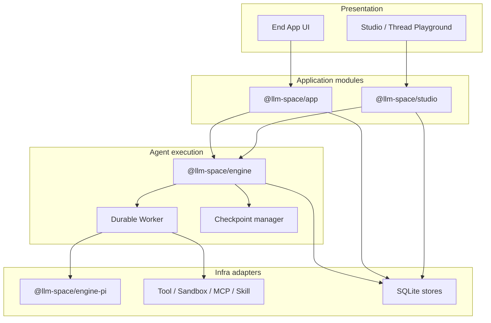
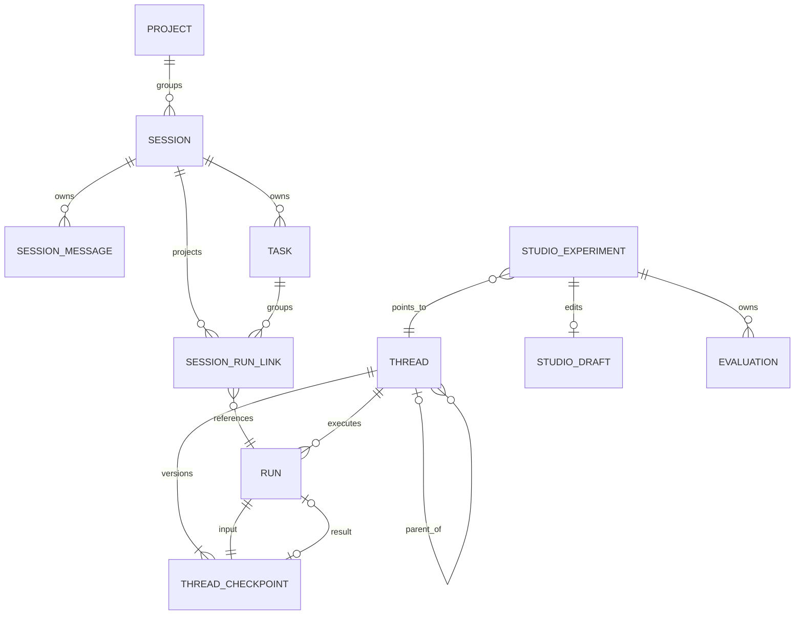
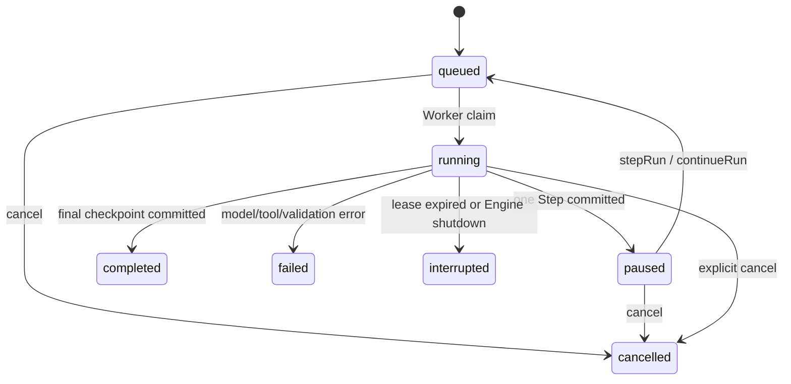
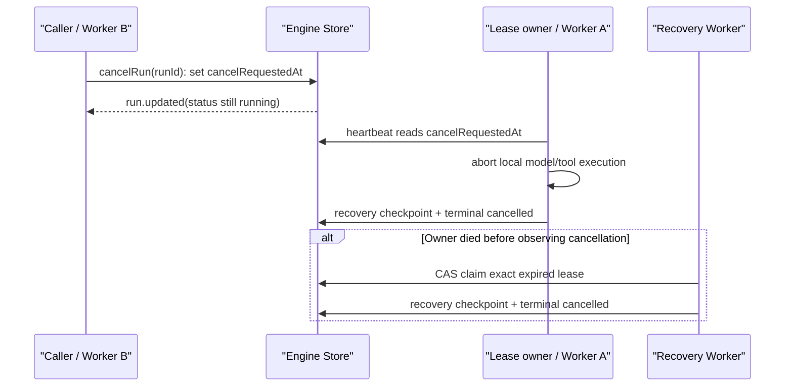
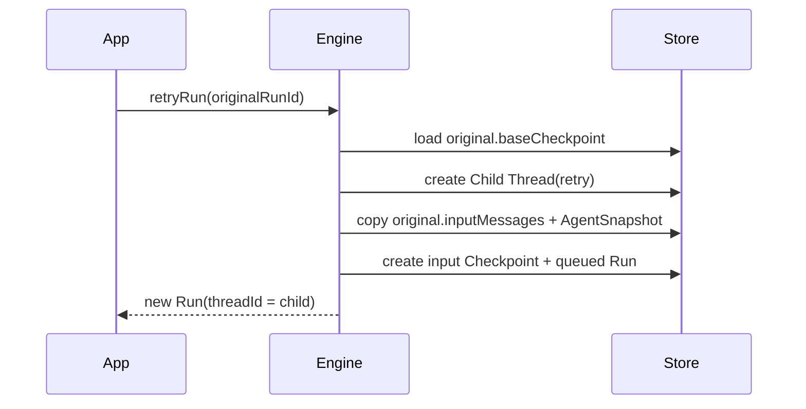
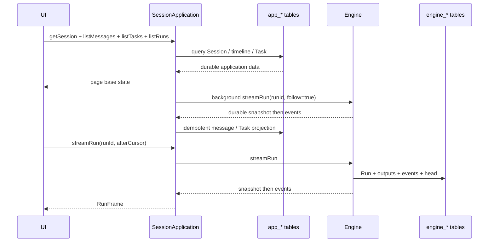
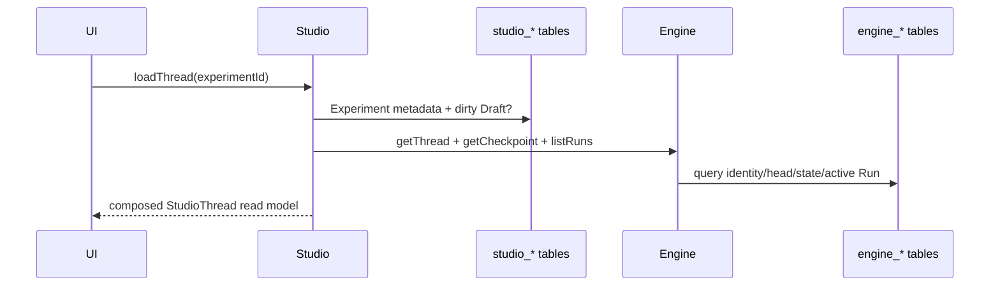

# Agent Application / Studio / Engine 架构

> 状态：Engine、Application、Studio v1 已落地；Compaction、Subagent、Approval suspension 尚未实现
> 更新：2026-08-12

## 1. 结论

系统保留四个核心概念：

```text
Session / Thread / Task / Run
```

但它们属于不同层：

```text
Application
  Project? -> Session -> SessionMessage*
                     -> Task* -> SessionRunLink* -> Engine Run

Agent Engine
  Thread -> Checkpoint* -> ThreadState
  Thread -> Run*
  Thread -> Child Thread*

Studio
  Studio Experiment -> Engine Thread
                    -> dirty Draft?
                    -> Run order / Evaluation*
```

核心约束：

1. `Session` 是端应用的稳定入口，`Thread` 是 Agent 可继续执行的状态身份，不能混用。
2. Session 只保存一个默认继续执行的 `threadId`。它不是 active Run，也不表示所有 Subagent Thread。
3. `SessionMessage` 是完整产品时间线，不受模型上下文压缩影响。
4. `ThreadState.messages` 是当前模型工作上下文，会被未来的 compaction 替换、裁剪或压缩。
5. `ThreadState.messages` 直接复用 `@llm-space/core.Message[]`，不再定义 `ConversationMessage`、`HarnessMessage` 或 `ModelMessage`。
6. `ThreadState.messages` 与 Agent 自定义 `state` 必须在同一个不可变 Checkpoint 中保存。
7. `Run` 是推动一个 Thread 前进的一次尝试；一个 Run 可以包含多个模型步骤和工具步骤。
8. Resume 使用同一个 Thread；Retry 从原 Run 的 base Checkpoint 创建 Child Thread；Handoff 以后由 Application 复制状态并创建新的 Session + Root Thread。
9. `Agent` 已经是执行定义，不再存在 Harness 实体或 Harness 包。执行内核统一命名为 Engine。
10. Engine、Application、Studio 可共用一个 SQLite 文件，但各自只拥有自己的表。
11. Run 创建采用 durable intent + `operationId` 对账，解决“Engine 已提交、Application/Studio 关联事务尚未提交”的崩溃窗口。
12. 取消请求先持久化到 Run，再由实际持有 lease 的 Worker 收敛到终态；它不是进程内 `AbortController` 的别名。

## 2. 分层



| 层          | 拥有                                                   | 不拥有                             |
| ----------- | ------------------------------------------------------ | ---------------------------------- |
| UI          | 查询缓存、stream overlay、输入框、选中态               | Session/Task/Thread/Run 的事实状态 |
| Application | Session、SessionMessage、Task、SessionRunLink          | 模型上下文、工具循环、Checkpoint   |
| Studio      | Experiment metadata、dirty Draft、Run 排序、Evaluation | Engine 当前 ThreadState            |
| Engine      | Thread、Checkpoint、ThreadState、Run、RunEvent         | Session、Task、Project、Studio     |
| Infra       | 模型、工具、Sandbox、持久化实现                        | 四个核心对象的业务决策             |

## 3. ER 关系



不存在 `ExecutionSession M:N Thread`：

- 一个 Run 永远只属于一个 Thread。
- 一个 Session 在某一时刻只保存一个默认 `threadId`。
- Retry 后 Session 可以把 `threadId` 切到新 Child Thread。
- 历史上涉及过哪些 Thread，通过 `SessionRunLink` 和 Thread parent 关系查询，不在 Session 上保存数组。
- Resume 不创建 Thread；Handoff 是复制，不共享 Thread identity。

## 4. Agent Engine 对象

### 4.1 Thread

```ts
interface Thread {
  schemaVersion: 1;
  id: string;
  parent?: {
    threadId: string;
    relationship: "retry" | "fork";
    sourceCheckpointId: string;
  };
  headCheckpointId: string;
  createdAt: number;
  updatedAt: number;
}
```

Thread 只保存 identity、可选 parent 和 head 指针：

- 不保存 `rootThreadId`；Root 判断为 `parent === undefined`。
- 不保存 `activeRunId`；active Run 从 Run 表查询。
- 不复制当前 messages/state。
- Engine v1 的 parent 关系只有 `retry | fork`；Subagent 是后续关系类型。

### 4.2 ThreadState 与 Checkpoint

```ts
interface ThreadState {
  messages: readonly import("@llm-space/core").Message[];
  state: Readonly<Record<string, JsonValue>>;
}

interface ThreadCheckpoint {
  schemaVersion: 1;
  id: string;
  threadId: string;
  parentCheckpointId?: string;
  sequence: number;
  source:
    | { type: "thread.created" }
    | {
        type: "thread.forked";
        sourceThreadId: string;
        sourceCheckpointId: string;
      }
    | { type: "run.input"; runId: string }
    | {
        type: "run.step";
        runId: string;
        step: "model.completed" | "tool.completed";
      }
    | { type: "run.recovery"; runId: string }
    | { type: "manual" };
  threadState: ThreadState;
  createdAt: number;
}
```

Checkpoint 是 Thread 可恢复状态的唯一事实来源。

当前提交粒度：

1. `thread.created`
2. `run.input`
3. 每个 `model.completed`
4. 每个 `tool.completed`
5. 中断工具补齐结果时的 `run.recovery`
6. Studio/manual 编辑进入 Engine 时的 `manual`

`ThreadState.messages` 会被压缩；Checkpoint 历史本身不会因为更新 head 而被覆盖。未来 Compaction 会创建新的 Checkpoint，不修改旧 Checkpoint。

### 4.3 Run

```ts
interface Run {
  schemaVersion: 1;
  id: string;
  threadId: string;
  operationId: string;
  retryOfRunId?: string;
  inputMessages: readonly Message[];
  baseCheckpointId: string;
  inputCheckpointId: string;
  agentSnapshot: AgentSnapshot;
  status:
    "queued" | "running" | "paused" | "completed" | "failed" | "cancelled" | "interrupted";
  control: {
    mode: "step" | "continue";
    toolCallId?: string;
  };
  pause?: {
    reason: "step.completed";
    step: "model.completed" | "tool.completed";
    checkpointId: string;
    pausedAt: number;
  };
  resultCheckpointId?: string;
  error?: { code?: string; message: string };
  workerId?: string;
  leaseExpiresAt?: number;
  cancelRequestedAt?: number;
  createdAt: number;
  startedAt?: number;
  completedAt?: number;
}
```

不变量：

- Run 只属于 Thread，不属于 Session 或 Studio。
- SQLite partial unique index 保证一个 Thread 最多一个 `queued | running | paused` Run。
- `startRun()` 在一个事务中创建 input Checkpoint、queued Run、推进 Thread head、写初始事件。
- Run 保存完整 AgentSnapshot；Worker Resolver 返回的 snapshot 必须与它完整相等（包括 model、instructions、tools），不能只匹配 `agentId + generationId` 后静默替换为最新代码。
- `operationId` 用于调用方幂等重试命令；同一个 id 只有在命令参数完全一致时才返回已有 Run。
- `startRun` 的一致性参数包括 Thread、base Checkpoint、input Messages、AgentSnapshot；`retryRun` 包括原 Run id。
- `cancelRequestedAt` 表示 durable cancellation intent。字段出现时 Run 仍可能短暂处于 `running`，直到持有 lease 的 Worker 或 lease recovery 写入 terminal 状态。

### 4.4 Run 状态



恢复规则：

- 重启后 `queued` Run 可以继续 claim。
- lease 过期的 `running` Run 变为 `interrupted`。
- 不自动重放正在执行的工具，因为外部副作用是否发生未知。
- 如果 Engine 中断或显式取消发生在工具执行中，且最后一个 AssistantMessage 存在没有 output 的 tool call，恢复 Checkpoint 会写入 synthetic error output，保持 Provider replay 消息完整；工具不会自动重试。

跨 Worker 取消流程：



取消优先于并发完成、失败和 lease expiry：这些写终态的路径都会重新读取 `cancelRequestedAt`。对正在执行的工具，取消只能停止后续推进，不能证明外部副作用没有发生，因此恢复逻辑补 synthetic tool output，但绝不自动重放工具。

### 4.5 Retry



Retry 不修改原 Run，也不在原 Thread 上追加：

- Child Thread 从原 Run 的 `baseCheckpointId` 创建。
- 新 Run 严格复用原 `inputMessages` 和 `agentSnapshot`。
- 新 Run 写 `retryOfRunId`。
- Application 接受该分支后，将 `Session.threadId` 切到 Child Thread。

## 5. Application 对象

### 5.1 Session

```ts
interface Session {
  schemaVersion: 1;
  id: string;
  projectId?: string;
  threadId: string;
  agentId: string;
  title: string;
  status: "active" | "archived";
  createdAt: number;
  updatedAt: number;
}
```

`threadId` 就是默认 continuation target，不再增加 `activeThreadId` 或 `continuationThreadId`：

- 下一次前台输入发给 `threadId`。
- 当前运行中的 Thread 集合从 Engine Run 查询。
- Retry 接受后更新 `threadId`。
- Subagent 将来可以产生多个 active Thread，但不会改变该字段的单值语义。

### 5.2 SessionMessage 继承关系

```ts
interface SessionMessageBase {
  schemaVersion: 1;
  id: string;
  sessionId: string;
  createdAt: number;
}

interface ModelSessionMessage extends SessionMessageBase {
  type: "model";
  threadId: string;
  runId?: string;
  message: import("@llm-space/core").Message;
}

interface SystemSessionMessage extends SessionMessageBase {
  type: "system";
  code: string;
  text: string;
}

interface UserActionSessionMessage extends SessionMessageBase {
  type: "user-action";
  action: string;
  detail?: string;
}
```

SessionMessage 和模型消息不是一张共享语义表：

- core Message 嵌入 `ModelSessionMessage.message`。
- 同一个 AssistantMessage 在工具完成后按 message id 幂等 upsert，最终包含 tool output。
- Session 时间线不会从当前 ThreadState 反查，因此 compaction 不会删除历史。
- system/user-action 记录只属于产品时间线，不会被隐式发给模型。

### 5.3 Task 与 Run Link

```ts
interface Task {
  schemaVersion: 1;
  id: string;
  sessionId: string;
  title: string;
  status: "pending" | "running" | "completed" | "failed" | "cancelled";
  createdAt: number;
  updatedAt: number;
}

interface SessionRunLink {
  schemaVersion: 1;
  sessionId: string;
  threadId: string;
  runId: string;
  taskId?: string;
  createdAt: number;
}
```

Task retry：

1. Application 校验原 Run 属于该 Session/Task。
2. 调用 `engine.retryRun()`。
3. 增加新的 SessionRunLink。
4. 将 Task 重新置为 `running`。
5. 将 Session.threadId 切到 retry Child Thread。
6. 原 Run、原分支和原 SessionMessage 均保留。

### 5.4 ApplicationRunIntent

```ts
type ApplicationRunIntent = {
  schemaVersion: 1;
  operationId: string;
  sessionId: string;
  taskId?: string;
  createdAt: number;
} & (
  | { type: "start"; message: Extract<Message, { role: "user" }> }
  | { type: "retry"; retryOfRunId: string }
);
```

这是 Application-owned 的短生命周期命令记录，不是第五个核心领域对象。Application 先写 intent，再调用 Engine，最后在一个事务中写 SessionRunLink、输入 SessionMessage、Task/Session 状态并删除 intent。正常 Engine 调用失败时删除 intent；Engine 已提交但关联事务失败时保留 intent，供当前进程重试或下次启动按 `operationId` 对账。幂等比较只比较 command 语义字段，不把 `createdAt` 当作输入；若 Engine 已存在匹配 Run，Application 直接补齐或复用关联，不再从已推进的 Thread head 重新发起命令。

## 6. Studio 对象

Studio 对外仍提供 `StudioThread` read model 以适配现有 Playground，但持久化实体是 Studio Experiment：

```ts
interface StudioExperimentRecord {
  schemaVersion: 1;
  id: string;
  engineThreadId: string;
  title: string;
  agent: AgentSnapshot;
  commitId?: string;
  draft?: ThreadState;
  pendingRun?: { operationId: string; createdAt: number };
  provenance?: { type: "fork"; threadId: string; checkpointId?: string };
  createdAt: number;
  updatedAt: number;
}
```

`StudioThread` 是组合查询结果：

```text
Studio Experiment metadata
  + Engine Thread
  + Engine head Checkpoint or dirty Draft
  + derived active Run
  = StudioThread read model
```

Draft 生命周期：

1. UI 编辑后 `saveDocument()` 只保存 dirty Draft，不推进 Engine head。
2. `run(fromMessageId)` 将消息前缀作为 base，用户消息作为 Run input。
3. 只有完整 input Message 与完整 base ThreadState 都和历史 Run 一致时，Studio 才调用 Engine `retryRun()` 创建 Child Thread；消息内容或 state 被编辑后会从编辑后的状态 fork 并创建新 Run。
4. 新 Run 创建成功后清除 Draft。
5. 后续 UI 查询重新从 Engine head Checkpoint 组合 read model。

`pendingRun` 是 Studio 的 durable command intent，不是 active Run 指针：Studio 先保存 `operationId`，再调用 Engine，最后在一个 Studio 事务中写 Run reference、清 Draft 和 `pendingRun`。若 Engine 调用本身失败则清 intent；若 Engine 已成功但 Studio 事务失败则保留，启动恢复通过 `getRunByOperationId()` 补齐关联。Studio 的公共查询会先等待这次启动对账完成。

这样允许 Studio 有编辑工作副本，同时避免 `StudioThread.document` 和 Checkpoint 都声称自己是执行当前状态。

Evaluation、Rubric、Run 排序属于 Studio，不进入 Engine。

## 7. UI 状态与协议

### 7.1 End App UI

推荐 UI 状态：

```ts
interface SessionPageState {
  session?: Session;
  messages: readonly SessionMessage[];
  tasks: readonly Task[];
  activeRuns: ReadonlyMap<string, RunOverlay>;
  composer: { text: string; attachments: readonly Attachment[] };
  loading: boolean;
  error?: string;
}
```

`RunOverlay` 是临时流状态；SessionMessage 是 durable base。页面重连后先查询 durable base，再用 Run snapshot 恢复 overlay。

### 7.2 Application API

当前公共能力：

```ts
interface SessionApplication {
  createSession(...): Promise<Session>;
  getSession(sessionId: string): Promise<Session | undefined>;
  listSessions(): Promise<readonly Session[]>;
  listMessages(sessionId: string): Promise<readonly SessionMessage[]>;
  recordSystemMessage(...): Promise<SystemSessionMessage>;
  recordUserAction(...): Promise<UserActionSessionMessage>;
  createTask(...): Promise<Task>;
  listTasks(sessionId: string): Promise<readonly Task[]>;
  listRuns(sessionId: string): Promise<readonly Run[]>;
  startRun(...): Promise<Run>;
  retryTaskRun(...): Promise<Run>;
  cancelRun(sessionId: string, runId: string): Promise<void>;
  streamRun(sessionId: string, runId: string, cursor?: RunEventCursor): AsyncIterable<RunFrame>;
}
```

建议跨 RPC/HTTP 的等价协议：

```text
GET  /sessions/:id
GET  /sessions/:id/messages
GET  /sessions/:id/tasks
GET  /sessions/:id/runs
POST /sessions/:id/messages/system
POST /sessions/:id/actions
POST /sessions/:id/runs
POST /sessions/:id/tasks/:taskId/runs/:runId/retry
POST /sessions/:id/runs/:runId/cancel
GET  /sessions/:id/runs/:runId/stream?afterCursor=N
```

### 7.3 Studio UI

当前 Desktop Project Studio 继续使用 `ProjectStudioTransport`：

- query：list/load Studio Thread read model、Run History、Evaluation。
- command：save dirty Draft、run、retry/fork、cancel。
- stream：Studio 将 Engine RunFrame 投影成 `message.delta`、`conversation.updated`、`run.completed|failed|cancelled`。

这层投影用于兼容现有 Thread Playground；Engine 本身仍以 Run stream 为唯一执行流协议。

## 8. 数据如何从存储层查询

### 8.1 Session 页面



Application 在 Run Link 创建后即启动后台投影，因此 SessionMessage 与 Task 终态不依赖某个 UI 是否正在订阅。UI 调用 `streamRun()` 仍会执行同一套幂等投影，作为低延迟路径和恢复兜底。

Application 启动时先处理 `app_run_intents`，再对已有 Run Link 读取 durable Run snapshot 并补齐 SessionMessage/Task 投影。`getSession`、列表查询和新命令都等待该恢复屏障，因此首屏不会先读到陈旧的 durable base；单个不一致 intent 会保留供诊断，但不会阻断其他 Session 的恢复。

### 8.2 Studio Thread



## 9. 流式协议

### 9.1 RunFrame

```ts
type RunFrame =
  | {
      type: "snapshot";
      cursor: number;
      run: Run;
      outputs: readonly RunOutputSnapshot[];
      headCheckpointId: string;
    }
  | {
      type: "event";
      cursor: number;
      event: RunEventData;
    };
```

订阅总是先返回 snapshot：

- `run`：durable 状态。
- `outputs`：模型 delta 合并后的 durable draft/completed AssistantMessage。
- `cursor`：snapshot 已覆盖到的最新事件游标。
- `headCheckpointId`：当前 Thread head。

之后 `follow=true` 才持续返回增量事件。

重要语义：

- UI stream 不是 Run 生命周期所有者；断开 stream 不取消 Run。
- 只有显式 `cancelRun()` 才取消。
- Application 后台投影独立消费 Run stream；Session timeline 与 Task 终态不依赖 UI subscriber。
- delta 会批量写 SQLite，同时 upsert RunOutputSnapshot。
- 重连不需要从头拼 token；先渲染 snapshot，再消费新 cursor 之后的事件。
- Engine 读取“事件批次 + Run terminal 状态”使用同一 Store snapshot，保证 terminal 前的最后一批事件不会丢失。

主要事件：

```text
run.updated
message.delta
thinking.delta
message.completed
tool.started
tool.updated (携带流式更新后的 AssistantMessage)
tool.completed (携带更新后的 AssistantMessage)
checkpoint.committed
```

`tool.completed` 携带更新后的 AssistantMessage，使 Application 能将包含 tool output 的最终消息幂等投影到 Session 历史。

## 10. 核心组件

### 10.1 Engine

| 组件                  | 职责                                                          |
| --------------------- | ------------------------------------------------------------- |
| `AgentEngine`         | Thread/Checkpoint/Run command + query + stream facade         |
| Durable Worker        | claim、lease、heartbeat、执行与恢复                           |
| `RunExecutor`         | 执行 Engine 选中的单个 Model/Tool Step；事件处理具备 awaited barrier |
| `AgentResolver`       | 严格解析 Run 固定的 Agent generation                          |
| Execution sink        | model/tool 事件、RunOutput、逐步 Checkpoint                   |
| `EngineStore`         | 同步事务 seam                                                 |
| `InMemoryEngineStore` | 测试 Adapter                                                  |
| `SqliteEngineStore`   | Bun SQLite 生产 Adapter                                       |

### 10.2 Application

| 组件                 | 职责                                                            |
| -------------------- | --------------------------------------------------------------- |
| `SessionApplication` | Session/Task command、Run intent/关联、Retry、stream projection |
| `ApplicationStore`   | app-owned 数据事务与启动对账                                    |
| Session projector    | Run snapshot/event -> SessionMessage + Task status              |

### 10.3 Studio

| 组件                   | 职责                                         |
| ---------------------- | -------------------------------------------- |
| `StudioApplication`    | Experiment、Draft、Run、History、Evaluation  |
| `PlaygroundApplication` | Playground、AgentSpec、Draft 与 Engine Run 控制 |
| Studio read composer   | metadata + Engine head/Draft -> StudioThread |
| Studio event projector | RunFrame -> Playground-compatible events     |
| `StudioStore`          | studio-owned 数据事务                        |

### 10.4 Infra

| 能力           | 接口/实现                                                            |
| -------------- | -------------------------------------------------------------------- |
| Agent loop     | Engine 负责 Step/Continue 外循环；Pi Model Step 复用 `agentLoopContinue()` 单轮 |
| Tool           | `PiRunExecutor` 调度 `@llm-space/agent` ToolDefinition + ToolContext |
| Durable step   | Engine awaited sink 提交 model/tool Checkpoint 后执行后端才能继续    |
| Agent state    | `defineState()` + AsyncLocalStorage + Checkpoint state               |
| Sandbox        | Host 注入 `ToolContext.getSandbox()`                                 |
| MCP/Skill/Auth | Host/runtime Adapter；Approval suspension 尚未接入 Engine v1         |
| Persistence    | Bun SQLite，WAL、foreign keys、busy timeout                          |

## 11. SQLite 表归属

### 11.1 Engine

```text
engine_schema_migrations
engine_threads
engine_checkpoints
engine_runs
engine_run_outputs
engine_run_events
```

关键约束：

- `engine_checkpoints(thread_id, sequence)` unique。
- `engine_runs(operation_id)` unique。
- `engine_runs(thread_id)` 在 `queued|running|paused` 上 partial unique。
- Thread 先插入、首 Checkpoint 后插入，但二者在同一事务中提交。

### 11.2 Application

```text
app_schema_migrations
app_sessions
app_tasks
app_session_messages
app_session_run_links
app_run_intents
```

Application 表不对 Engine 表声明业务 FK；跨层关系由稳定 id 和 Application command 保证，避免 Application 取得 Engine 表所有权。

`app_run_intents` 保存 command type、Session/Task、input Message 或 retry source 与 `operationId`。Engine 调用失败时删除；Engine 已提交而 Application 关联事务失败时保留，供下次启动对账。

### 11.3 Studio

```text
studio_schema_migrations
studio_experiments
studio_run_references
studio_evaluations
studio_rubrics
studio_events
studio_playgrounds
```

Studio 的 pending Run intent 是 `studio_experiments.payload_json` 内的 `pendingRun` 字段，不额外引入一个 Run 实体或 active Run 字段。

Desktop 使用：

```text
~/.llm-space/studio/studio.sqlite
~/.llm-space/studio/projects/<project-id>/studio.sqlite
```

同一个文件中 Engine 使用 `engine_*`，Studio 使用 `studio_*`。

旧 `threads/*.json`、`.llm-space/harness/*` 不迁移、不读取，也不由升级代码自动删除用户磁盘文件。

## 12. 当前实现状态

| 能力                                         | 状态                    |
| -------------------------------------------- | ----------------------- |
| Engine Thread/Checkpoint/Run                 | 已实现                  |
| core Message 富内容直存                      | 已实现                  |
| SQLite Engine/App/Studio Store               | 已实现                  |
| 单 active Run、atomic startRun               | 已实现                  |
| Durable output snapshot + cursor stream      | 已实现                  |
| Pi 单 Model Step、图片/tool result replay    | 已实现                  |
| Engine Step/Continue 同 Run 暂停恢复         | 已实现                  |
| awaited model/tool Checkpoint barrier        | 已实现                  |
| Tool loop + schema validation                | 已由 PiRunExecutor 实现 |
| Agent `defineState()` checkpoint             | 已实现                  |
| Retry Child Thread                           | 已实现                  |
| Worker lease/interrupted recovery            | 已实现                  |
| Durable cross-Worker cancellation            | 已实现                  |
| synthetic interrupted tool output            | 已实现                  |
| Session/Task/SessionMessage projection       | 已实现                  |
| Application/Studio Run intent crash recovery | 已实现                  |
| system/user-action Session timeline API      | 已实现                  |
| Studio Draft + Engine read model             | 已实现                  |
| Desktop Project Studio 迁移                  | 已实现                  |
| basic-agent App/Engine/SQLite tracer bullet  | 已实现                  |
| 主窗口 Playground SQLite/Engine 迁移         | 已实现                  |
| Playground MCP 工具解析、执行与错误结果持久化 | 已实现                  |
| Playground function/provider-hosted/Plugin 工具 | Engine v1 明确拒绝；后续实现 |
| Playground/Project 模型连接 profile 选择     | Engine v1 暂用 provider 默认 profile；后续传递瞬时引用 |
| 主窗口 Projects catalog / 独立 Experiment IDE | 已实现                  |
| 旧本地 `core.Thread` JSON 自动迁移           | 不做；仅支持显式导入    |
| Compaction                                   | 未实现                  |
| Subagent Thread 关系与调度                   | 未实现                  |
| Tool approval/auth suspension                | 未实现                  |
| Handoff Application command                  | 未实现                  |
| 多进程 Worker claim 压力验证                 | 未实现                  |

## 13. 包依赖方向

```text
@llm-space/agent       @llm-space/core
        \                 /
         \               /
          @llm-space/engine
             ^       ^
             |       |
 @llm-space/engine-pi |
                     |
        @llm-space/app   @llm-space/studio
                     \   /
                 Desktop / basic-agent
```

禁止方向：

- Engine 依赖 App 或 Studio。
- core 定义 Session/Task。
- UI 直接写 Engine Store/Application Store。
- Studio 把 dirty Draft 当作 Engine 当前状态。
- Application 从当前 ThreadState 重建完整 Session transcript。
- 再次引入 Harness compatibility package 或 Harness message type。
