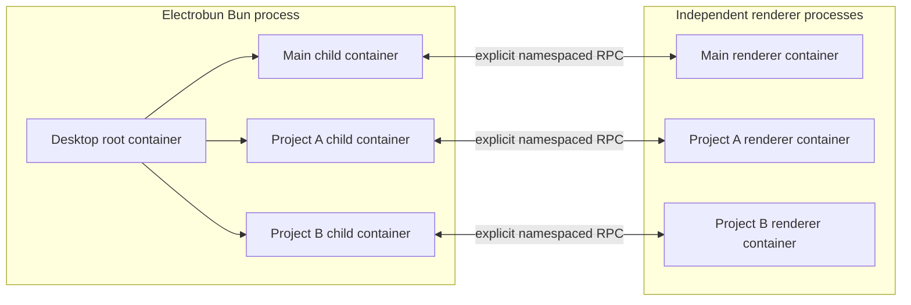
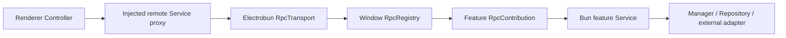

# Desktop architecture redesign

> Status: approved design baseline
> Date: 2026-08-17
> Scope: `apps/desktop` internals

This document defines the target architecture for the Electrobun Desktop
application. It incorporates the architecture interview decisions and the
verified Eclipse Theia patterns documented in:

- [`research/2026-08-17-eclipse-theia-di-application-rpc.md`](./research/2026-08-17-eclipse-theia-di-application-rpc.md)
- [`research/2026-08-17-eclipse-theia-command-layer-placement.md`](./research/2026-08-17-eclipse-theia-command-layer-placement.md)

The migration sequence is defined separately in
[`desktop-architecture-migration-plan.md`](./desktop-architecture-migration-plan.md).

## 1. Goals

- Make Inversify the only object-graph assembler for long-lived Desktop
  objects.
- Make process, native-window, renderer-window, and interaction-session
  lifetimes explicit and mechanically isolated.
- Give `DesktopApp`, Main and Project window applications, Services,
  Controllers, Registries, and Contributions non-overlapping responsibilities.
- Replace mechanical RPC Client/Server wrappers with one typed remote Service
  seam per namespace.
- Prefer direct injected dependencies; use typed events only for one-to-many
  facts that have already occurred.
- Make architectural violations fail in tests or lint rather than survive as
  documentation drift.

## 2. Non-goals

- No UI redesign or new product feature.
- No persistence schema, snapshot format, command id, shortcut, menu, or deep
  link change.
- No change to Thread, Playground, or Studio execution semantics.
- No public `packages/*` API change unless Desktop cannot adapt without one.
- No dynamic extension system, automatic module discovery, or runtime DI
  registration.
- No copy of Theia's reflective JavaScript RPC proxy or `setClient()` callback
  protocol.

## 3. Architectural thesis

Desktop consists of two independent object graphs:



There is no shared DI container across Bun and renderer. Shared code defines
contracts and serializable values, never shared object instances.

The architecture favors deep modules: an interface must hide meaningful
lifecycle, concurrency, protocol, or domain complexity. A class that merely
renames another interface fails the deletion test and should be removed.

## 4. Container topology and ownership

Use raw Inversify `Container`; delete custom process/window/renderer Scope
wrappers.

Containers keep Inversify's transient default and disable autobinding. Every
singleton lifetime is stated on its binding; resolution must never succeed only
because a class happened to be decorated.

| Container        | Parent          | Single Application root    | Owns                                                        |
| ---------------- | --------------- | -------------------------- | ----------------------------------------------------------- |
| Desktop          | none            | `DesktopApp`               | process Services, global managers, Playground runtime       |
| Main window      | Desktop         | `MainWindowApplication`    | native Main window, window RPC adapters                     |
| Project window   | Desktop         | `ProjectWindowApplication` | native Project window, Project/Studio/source runtime        |
| Renderer window  | none            | `RendererApplication`      | remote Service proxies, CommandRegistry, window Controllers |
| Renderer session | renderer window | `RendererApplication`      | Settings/Onboarding/Editor session state                    |

Main and Project containers are siblings. Project must not inherit Main-only
bindings, and closing Main must not invalidate a Project window.

The only modules allowed to hold a `Container` reference are:

- Bun/renderer bootstrap functions;
- the Bun window-container factory;
- explicit renderer session-container creation functions and lifecycle Provider;
- tests of container composition.

Application roots, Services, Controllers, Registries, and Contributions never
inject `Container`, call `get()`, or load a module.

## 5. Application roots and entrypoints

### 5.1 Bun entrypoint

```text
bun/index.ts
  -> bootstrapDesktopApp()
      -> create Desktop container
      -> load explicit process modules
      -> resolve DesktopApp exactly once
      -> run DesktopApp
```

`bootstrapDesktopApp()` owns shell hydration, cold-start capture, module order,
root-container cleanup, and composition-failure rollback. It does not implement
feature behavior.

`DesktopApp` owns the process startup/stop transaction. Its fixed dependencies
include launch routing, Main and Project window managers, Analytics, and
Updater. It does not own feature RPC registration or native window creation.

`DesktopApp.start()` resolves only after:

1. platform quit/reopen/menu adapters are connected;
2. deep-link delivery is connected and cold-start targets are settled;
3. at least one cold-start target window is created;
4. persisted Project-window restoration has been attempted.

Analytics and update scheduling start in the background and do not block
application readiness.

### 5.2 Window roots

The production `WindowContainerFactory` is the only module that creates Bun
window child containers. Its small interface hides module selection, container
creation, Application resolution, startup rollback, and two-phase disposal.

```ts
interface WindowContainerFactory {
  createMain(): Promise<WindowApplicationHandle>;
  createProject(input: ProjectWindowInput): Promise<WindowApplicationHandle>;
}
```

`MainWindowManager` owns the at-most-one-Main invariant.
`ProjectWindowManager` owns one-window-per-project identity, catalog
persistence, restore, and close-all behavior. Managers depend on the factory,
not on Inversify.

`MainWindowApplication` owns one Main native-window lifecycle. It starts the
window RPC Registry, creates the native window, attaches it to the native
window capability, and coordinates renderer readiness.

`ProjectWindowApplication` additionally starts `ProjectService` before
exposing RPC or creating the renderer. Project-derived identity is read from
the started Service; it is not late-bound into the container.

### 5.3 Renderer entrypoint

```text
mainview/main.tsx
  -> bootstrapRenderer()
      -> create one Electrobun RPC transport
      -> perform the sole pre-container request: WindowContext
      -> create renderer container
      -> load common + Main/Project modules
      -> resolve RendererApplication exactly once
      -> start application and mount React
```

React does not create, start, or dispose the renderer container.
StrictMode remounts therefore cannot restart process-like renderer Services.

Renderer shutdown order is:

1. reject new Commands and remote events;
2. unmount React while injected objects are still valid;
3. stop Controllers and other renderer lifecycle Contributions in reverse
   start order;
4. call `rendererContainer.unbindAllAsync()`.

`useInject()` is permitted only at a page, feature-root, or Provider adapter.
Reusable presentation modules receive state and actions through props.

## 6. DI policy

### 6.1 What enters a container

Container-created, long-lived state or orchestration objects use
`@injectable()` and explicit constructor `@inject()`/`@multiInject()`:

- Application roots;
- Services and Managers;
- Controllers;
- Registries and Contributions;
- production adapters with owned lifetimes.

DTOs, value objects, pure functions, React presentation, native handles, and
short operations do not enter a container.

### 6.2 Tokens

- Internal unique implementation: use the concrete class as identity.
- Interface seam, platform value, or runtime input: use a feature-owned
  `Symbol()` plus the same-named interface/type.
- Open collection: use one feature-owned Symbol and repeated bindings.
- Delete `desktopToken()`, `rendererToken()`, and any central token dictionary.
- Do not use `Symbol.for()`; consumers import the single exported Symbol.

```ts
export const RpcContribution = Symbol("RpcContribution");

export interface RpcContribution {
  registerRpc(registry: RpcRegistry): void;
}
```

### 6.3 Multiple implementations

Use native Inversify multi-binding. Delete `SnapshotContributionProvider`.

```ts
@injectable()
class RpcRegistry {
  constructor(
    @multiInject(RpcContribution)
    contributions: RpcContribution[]
  ) {}
}
```

One object implementing multiple contribution interfaces is bound once and
aliased with `toService()`:

```ts
bind(ProjectContribution).toSelf().inSingletonScope();
bind(RpcContribution).toService(ProjectContribution);
bind(RendererLifecycleContribution).toService(ProjectContribution);
```

All modules load before the Application root resolves. Runtime late binding is
unsupported.

### 6.4 Modules

`*-module.ts` files contain bindings, aliases, and lifetime declarations only.
They perform no I/O, start no task, and construct no ordinary long-lived class
with `new`.

Use `toSelf()`/`to()` for ordinary classes, `toConstantValue()` for external
platform values and runtime input, and `toDynamicValue()` only for a genuine
runtime-parameterized adapter such as a generic RPC proxy.

Bootstrap and the two container factories explicitly list every module. There
is no filesystem scan, decorator discovery, or catch-all feature aggregation.

## 7. Class responsibility vocabulary

| Name                   | Interface responsibility                                                  |
| ---------------------- | ------------------------------------------------------------------------- |
| `App` / `Application`  | A container lifecycle root or a lifecycle-bearing use-case/resource owner |
| `Service`              | A deep feature module exposing use cases or a stable capability           |
| `Manager`              | Owns an identified collection of resources and their lifetimes            |
| `Controller`           | Renderer-only interaction state machine with snapshot/actions             |
| `Registry`             | Consumes Contributions, validates registration, owns dispatch             |
| `Contribution`         | Adapts an existing module into one Registry protocol                      |
| `Repository` / `Store` | Persistence interface without business orchestration                      |
| `Adapter`              | Concrete implementation at an explicit seam                               |

`Client` is not the name of a renderer RPC proxy. It is reserved for a real
reverse-callback protocol if one is ever required.

Applications are not feature pass-through facades. A feature Application is
valid when it owns a complete use case plus resources/lifecycle, such as the
process-owned `DesktopPlaygroundApplication`. A class that only forwards a
Service into RPC is deleted or renamed to the responsibility it actually owns.

## 8. Class collaboration: direct calls, events, Commands, and RPC

Choose collaboration by semantics:

| Need                                                  | Mechanism                      |
| ----------------------------------------------------- | ------------------------------ |
| Required result, ordering, or failure propagation     | Direct injected interface call |
| One-to-many notification of an already-committed fact | Feature-owned typed Event      |
| Menu/shortcut/palette/toolbar UI intent               | Renderer Command               |
| Cross-runtime request/state change/execution sequence | RPC request/event/stream       |
| Presentation child-to-parent interaction              | React props callback           |

Classes must not accept option callbacks such as `fetchModels`, `openProject`,
or `notifyError` when those callbacks represent stable object dependencies.
Inject `ModelsService`, `NavigationService`, or `NotificationService` instead.

Callbacks remain valid at React props, third-party callback adapters, and small
strategy/factory seams.

### 8.1 Typed events

Do not create a global Event Bus. A Service privately owns its emitters and
exposes read-only typed subscription interfaces:

```ts
type Event<T> = (listener: (event: T) => void) => Disposable;

@injectable()
class ModelsService {
  private readonly _didChange = new Emitter<ModelsChanged>();
  readonly onDidChange = this._didChange.event;
}
```

Events:

- use past-tense names such as `onDidChange` or `onDidClose`;
- fire after authoritative state commits;
- never request a result or control startup ordering;
- isolate listener failures so one listener cannot block another;
- return a Disposable subscription owned by the subscriber's lifecycle.

## 9. RPC architecture

### 9.1 One namespace, one remote Service

Each namespace defines one remote Service contract:

```text
models.*        <-> ModelsService
skills.*        <-> SkillsService
window.*        <-> WindowService
projectSource.* <-> ProjectSourceService
studio.*        <-> StudioService
thread.*        <-> ThreadService
```

Do not aggregate by window into `DesktopService`, `NativeService`, or
`ProjectClient`.

Shared feature protocol files own:

- the Service Symbol and compile-time request/stream/event contract;
- serializable request/stream/event payloads;
- the immutable namespace manifest.

The generic renderer proxy projects the namespace contract into callable
request/stream members plus typed `on(...)` subscriptions, so no feature Client
adapter is required:

```ts
export const ModelsService = Symbol("ModelsService");

export interface ModelsRpc {
  readonly requests: {
    list(): Promise<readonly Model[]>;
  };
  readonly streams: Record<never, never>;
  readonly events: { changed: ModelsChanged };
}
```

The Bun `ModelsService` implements the request behavior and owns a local typed
event source. Its contribution adapts both into `RpcServer<ModelsRpc>`. The
renderer binding is `RpcClient<ModelsRpc>`, generated from the same explicit
manifest.

The generic renderer proxy is bound directly to the Service Symbol in the
renderer feature module. Delete feature factories whose only behavior is
calling `createRpcClient()`.

On Bun, the feature Service implements request behavior and exposes typed event
sources. A narrow `RpcContribution` registers that Service with the Registry.
Delete `*RpcServer` classes that only copy a Service into a `requests` field.
Keep a dedicated RPC adapter only when the seam performs argument projection,
authorization, compatibility, or error translation.



### 9.2 Transport semantics

- Request: one invocation and one result.
- Event: long-lived state-change notification.
- Stream: one invocation's ordered sequence with completion, failure, and
  cancellation.
- Renderer callback proxies and Bun `setClient()` state are prohibited.
- `AbortSignal` is translated by the generic transport and propagated to Bun.
- Cancellation is not a business failure and produces no error toast.

### 9.3 Failure contract

- Known, user-recoverable domain failures use stable codes and safe details.
- `RpcRegistry` serializes errors exactly once.
- Renderer proxies restore one remote error representation.
- Controllers choose notification, retry, rollback, or silence.
- Unknown Bun errors retain full local diagnostics but expose only safe remote
  details.
- Do not combine exception and `Result<T, E>` protocols for the same seam.

## 10. Command architecture

Follow Theia's runtime placement:

```text
menu / keybinding / toolbar / palette
  -> renderer CommandRegistry
      -> renderer feature handler
          -> injected remote Service
              -> Bun RPC Service
```

Each renderer-window container owns one `RendererCommandRegistry` singleton
behind the injected `CommandService` interface. Fixed DI contributions register
their handlers during renderer lifecycle startup; React-owned stateful handlers
register through the Commands Provider while their view is mounted.

Bun has no second CommandRegistry or CommandContribution collection. Native
menus forward a command id to the target renderer. If Bun ever needs to request
a renderer UI command, it uses a per-window `CommandService` transport; it does
not create a Bun command bus.

Commands may return typed values. A feature use case must not have parallel Bun
Command and RPC request handlers.

## 11. Native-window construction

RPC must exist before Electrobun creates a `BrowserWindow`, while window
capabilities need the created window. Resolve this with one attach-once module:

```text
resolve WindowApplication
  -> RpcRegistry has all Contributions
  -> create Electrobun RPC bridge
  -> NativeWindowFactory.create({ rpc })
  -> NativeWindowService.attach(browserWindow)
```

`NativeWindowService` is bound before Application resolution. It rejects
window-dependent operations before attach, permits attach exactly once, and
exposes a narrow capability interface. Feature modules never inject the raw
`BrowserWindow`, and the container never late-binds it.

## 12. Synchronous construction and explicit start

Container resolution is synchronous. Constructors establish in-memory
invariants only. Filesystem, SQLite, watcher, network, and process work occurs
in explicit `start()` methods coordinated by an Application root.

Do not use async `toDynamicValue()`, `container.getAsync()`, or asynchronous
`@postConstruct()` to assemble the production object graph.

Startup failures roll back resources already started by the Application, after
which the owning factory calls `unbindAllAsync()` on the child container.

## 13. Disposal

Container teardown has two phases:

1. `Application.stop()` performs business-ordered shutdown.
2. The container owner calls `unbindAllAsync()` for local deactivation and
   binding cleanup.

Inversify deactivates identifiers without dependency-aware reverse ordering,
so `unbindAllAsync()` must not encode business shutdown order.

`@preDestroy()` is limited to idempotent cleanup of one Service's own resource
and serves as a failure-path backstop. It does not replace Application-level
shutdown transactions.

Window stop order is: reject new RPC, cancel streams/subscriptions, detach
renderer transport, close native window, then unbind the child container.

Desktop stop order is: disconnect launch delivery, close Project and Main
Applications, stop process background Services, then unbind the Desktop
container.

## 14. Renderer state ownership

| State kind                                    | Owner                             |
| --------------------------------------------- | --------------------------------- |
| Stateless remote communication                | injected remote Service proxy     |
| Repeatable remote resource with invalidation  | TanStack Query                    |
| Event/stream/concurrency/workflow state       | Controller                        |
| Settings/Onboarding/Editor draft and rollback | session Controller                |
| Purely visual transient state                 | React state                       |
| High-frequency per-Thread editor state        | existing per-Thread Zustand store |

One authoritative value has one owner. A Query and Controller must not retain
parallel copies of the same list. Components do not subscribe directly to RPC
events.

A Controller is public only when it represents an independently mounted UI
workflow. Aggregate Controllers must enforce cross-state invariants; they must
not merely re-export child methods and snapshots.

## 15. Renderer session containers

Settings, Onboarding, Custom Model Editor, and Image Model Editor use real child
containers because they have runtime inputs and independent start/stop
lifetimes.

Each explicit session creation function creates the child, binds immutable
session input, and loads one session module. The session Provider resolves and
starts its root Application. Closing first invalidates the workflow, retains the
visual shell only through its close animation, then unmounts the Provider,
stops the Application, and calls `unbindAllAsync()` on only that child.
Reopening after closure creates a fresh child rather than reusing state retained
by a lazy dialog mount.

Ordinary dialogs, popovers, and dropdowns do not enter DI.

## 16. Product runtime ownership

`DesktopPlaygroundApplication` belongs to the Desktop root container and
directly owns Playground Studio/Pi/SQLite/tool composition. Closing Main
releases only Main window adapters; Playground catalog and active Runs remain
alive and reconnect to a reopened Main window. There is no duplicate
`PLAYGROUND_APPLICATION` token or pass-through Playground facade.

Project source, Studio, watcher, and Thread execution belong to their Project
child container and stop when that Project window closes. A future requirement
for background Project runs would require an explicit process-level Project
session owner rather than silently widening the current lifetime.

## 17. Physical source layout

Organize by runtime first, then vertical feature:

```text
apps/desktop/src/
  bun/
    app/
    <feature>/
  app/
    di/
    <feature>/
  components/
  commands/
  host/
  shared/
  mainview/
```

A Bun feature directory co-locates Service, RPC Contribution, Module, and
private adapters. An `app/` renderer feature co-locates Controller, Command
Contribution, Module, and Desktop-only presentation. Shared contains only
cross-runtime contracts and serializable values.

Delete the top-level `client/`; renderer remote Services bind directly in
`app/di/`. Keep `app/` as the renderer application layer rather than creating a
second `renderer/` tree. Cross-Desktop/Web UI remains in `packages/ui`.

## 18. Mechanical guardrails

- `shared/` cannot import `bun/` or `app/`.
- `app/` cannot import Bun implementations.
- `Container` imports are restricted to bootstrap/container factories/tests.
- `ContainerModule` imports are restricted to `*-module.ts` and composition
  tests.
- No top-level `client/` directory or aggregated remote Service.
- Container tests verify singleton aliases, multi-binding, child isolation, and
  deactivation.
- Application tests inject failure at every start phase and verify rollback.
- RPC tests cover request, event, stream, cancellation, and safe errors.
- Real Electrobun CEF verification covers Main/Project create, close, reopen,
  and process shutdown.

## 19. Current-to-target mapping

| Current                                               | Target                                        |
| ----------------------------------------------------- | --------------------------------------------- |
| `DesktopProcessContainer`, `DesktopWindowScope`       | raw Container + `WindowContainerFactory`      |
| `RendererScope`                                       | renderer Container + `RendererApplication`    |
| `SnapshotContributionProvider`                        | `@multiInject()`                              |
| `DesktopWindowRuntime` + dispersed factory lifecycle  | Main/Project Window Applications              |
| `DesktopLaunchController`                             | `DesktopLaunchService`                        |
| `ModelsApplication`                                   | `ModelsService`                               |
| duplicated Playground interface/implementation/facade | one concrete `DesktopPlaygroundApplication`   |
| `client/create*Client()`                              | renderer Service proxy bindings               |
| pass-through `*RpcServer`                             | direct feature `RpcContribution` registration |
| Bun `CommandRegistry`                                 | removed; renderer Registry is authoritative   |
| callback-heavy Controller options                     | injected Services + typed Events              |
| `app/di/*Scope*`                                      | explicit renderer/session container factories |

This table is a direction, not permission to perform mechanical renames. Each
module must pass the deletion test and preserve the agreed interface
responsibility.
