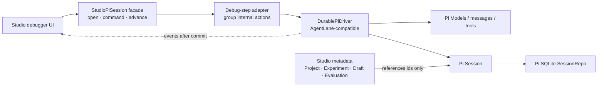

# Pi Session 作为唯一事实来源时的 durable 单步方案

> 调研日期：2026-08-14  
> 目标版本：`@earendil-works/pi-agent-core@0.84.1`  
> 结论先行：**能做，但不能靠继承现有 `Agent` 或 `beforeToolCall`/`afterToolCall` 补出来。可行路径是实现一个 `AgentHarness`-compatible durable driver，以 Pi `Session`/`SessionRepo` 为唯一执行事实来源，再用一个很薄的 Studio adapter 把内部 effect action 聚合成“模型一步 / 工具一步 / 连续运行”。**

> 后续决策：团队选择不 fork Pi。本文的一手研究、恢复协议和原型证据继续有效；最终自研 Harness 的模块/API、迁移与验收方案以 [`Durable Pi Agent Harness Design`](../superpowers/specs/2026-08-14-durable-pi-agent-harness-design.md) 为准。

## 1. 调研结论

1. Pi 0.84.1 已经发布了完成度很高的 **Session 数据层**：conversation entry tree、lane pointer、operation record、global fact、统一 `seq`、Memory/JSONL repo，以及独立的 SQLite backend。它足以成为 Studio 消息、运行状态、恢复状态和调试位置的唯一事实来源。[Session types](https://github.com/earendil-works/pi/blob/53fa77ccd8a279eb87e92294ef3687b03ff80112/packages/agent/src/harness/session/types.ts#L1-L352) · [Session facade](https://github.com/earendil-works/pi/blob/53fa77ccd8a279eb87e92294ef3687b03ff80112/packages/agent/src/harness/session/session.ts#L1-L204)
2. 同一版本也发布了 `AgentHarness`、`AgentLane`、`drive: "manual"`、`peekAction()`、`executeAction()` 等正确方向的**类型**，但执行实现仍是 scaffold：restore、prompt、resume、manual drive、hooks、events 全部抛 `HarnessNotImplemented`。[AgentHarness scaffold](https://github.com/earendil-works/pi/blob/53fa77ccd8a279eb87e92294ef3687b03ff80112/packages/agent/src/harness/agent-harness.ts#L305-L420) · [scaffold tests](https://github.com/earendil-works/pi/blob/53fa77ccd8a279eb87e92294ef3687b03ff80112/packages/agent/test/harness/agent-harness-scaffold.test.ts#L56-L198)
3. `beforeToolCall` / `afterToolCall` 只能围绕**本次进程内**的工具 Promise 做拦截。它们没有 durable intent、恢复游标和 tool replay policy；`block` 会生成错误 tool result，`terminate` 只是禁止自动 follow-up，并不是暂停。因此它们可以作为 driver 的 hook phase，不能充当 driver。[published README: tool hooks](https://github.com/earendil-works/pi/blob/53fa77ccd8a279eb87e92294ef3687b03ff80112/packages/agent/README.md#L113-L124) · [loop implementation](https://github.com/earendil-works/pi/blob/53fa77ccd8a279eb87e92294ef3687b03ff80112/packages/agent/src/agent-loop.ts#L276-L457)
4. 继承也不是解法。`AgentHarness` 的 constructor 是 `private`；`Agent` 虽可构造，但 transcript、active run、loop config 和事件处理都是 private orchestration，且底层 loop 一次执行完整 assistant + tool batch，无法在 provider/tool effect 前后插入 durable commit。[AgentHarness constructor](https://github.com/earendil-works/pi/blob/53fa77ccd8a279eb87e92294ef3687b03ff80112/packages/agent/src/harness/agent-harness.ts#L305-L353) · [Agent private runtime](https://github.com/earendil-works/pi/blob/53fa77ccd8a279eb87e92294ef3687b03ff80112/packages/agent/src/agent.ts#L73-L330)
5. **自己写一个 Pi Agent 可以做到**，但准确说应当写的是 durable Pi driver，而不是另一个内存 `Agent`：复用 Pi Models、messages、tools、Session/SessionRepo 和 SQLite backend；自己补齐 Harness 的 effects boundary、recovery reducer、lane mutation line 和 manual gate。
6. 最稳的交付形态不是 deep import 或 monkey patch，而是：
   - 首选：在 Pi fork/patch 中补全 `AgentHarness`，内部实现不另造公共协议；
   - 不能等待上游时：在 LLM Space 中以**组合**实现 `AgentLane`-compatible driver，并把所有 copied/internal Pi code 隔离在一个 package；Studio 只看三入口 facade。
7. Studio 切换后不再把 Engine checkpoint、App Session message 或 Studio run-frame 当执行副本。Project、Experiment、Draft、Evaluation 等产品元数据仍可由 Studio 持有，但它们只能引用 `sessionId`、`lane`、`runId`、`entryId`/`leafId`；消息和执行游标只从 Pi Session 读。

## 2. 版本与第一方证据

本仓库 catalog 声明 `^0.84.1`，lockfile 解析为 `0.84.1`。npm 的官方 metadata 表明当前 latest 仍是 `0.84.1`，tarball 的 `gitHead` 是 `53fa77ccd8a279eb87e92294ef3687b03ff80112`。[npm 0.84.1 metadata](https://registry.npmjs.org/@earendil-works/pi-agent-core/0.84.1) · [仓库 tag commit](https://github.com/earendil-works/pi/tree/53fa77ccd8a279eb87e92294ef3687b03ff80112/packages/agent)

本次逐项核对了：

- 本地发布包的 `package.json`、README、全部 `dist` JS/d.ts；
- v0.84.1 tag 的 `docs/harness-v2.md`、`AgentHarness` scaffold、session types、`Session`/`SessionState`、reducer 和相应 tests；
- `@earendil-works/pi-session-backend-sqlite-node` 的 schema、repo、writer lease 与 tests；
- 上游 `main` 在 `9d2ec7ffabe927bfad2214c1cee25b6632a78dcf`（2026-08-13）的状态。

需要特别注意：上游 `main` 已把 `harness-v2.md` 替换为新的 `harness.md`，设计从 append-only operation records + recovery reduction 改成了 entry/register/usage 三存储和 total `op.state` program counter；但 `AgentHarness` 实现与 0.84.1 仍相同，依旧是 scaffold。[main AgentHarness](https://github.com/earendil-works/pi/blob/9d2ec7ffabe927bfad2214c1cee25b6632a78dcf/packages/agent/src/harness/agent-harness.ts#L305-L420) · [main 新存储模型](https://github.com/earendil-works/pi/blob/9d2ec7ffabe927bfad2214c1cee25b6632a78dcf/packages/agent/docs/harness.md#L80-L137)

这意味着：**0.84.1 的 Session 能立即复用，但自行实现其 record protocol 会形成一个需要版本锁定和未来迁移的持久化格式。** 不能假定“等升级 npm 就自动得到相同实现”。

## 3. 已发布 API：哪些可用，哪些只是外壳

| 能力                                                                        |               public/exported |          0.84.1 是否可运行 | 结论                                                                      |
| --------------------------------------------------------------------------- | ----------------------------: | -------------------------: | ------------------------------------------------------------------------- |
| `Agent`、`agentLoop*`                                                       |                            是 |                         是 | 内存自动 loop；适合普通运行，不是 durable stepping kernel                 |
| `Session`、`SessionTree`、`SessionRepo`、records/types                      |                            是 |                         是 | 可直接成为事实来源                                                        |
| `InMemorySessionRepo` / `JsonlSessionRepo`                                  |                            是 |                         是 | 后端 conformance 已存在                                                   |
| SQLite `SqliteSessionRepository`                                            |              独立 npm package |                         是 | 需要新增依赖；本仓库当前未安装                                            |
| `AgentHarness` / `AgentLane` / `ActionInfo`                                 |                            是 |       仅配置 getter/setter | 可把 interface 当目标，不可直接运行                                       |
| recovery `validateRecordLog()` / `reduceLaneState()`                        | 文件内 export，但根入口未导出 |                   实现存在 | package `exports` 禁止受支持的 deep import；只能上游导出、fork 或本地重写 |
| `streamAssistant`、`prepareToolCall`、`executeToolCall`、`finalizeToolCall` |                只在设计文档中 | 未按此 public surface 发布 | durable driver 必须抽取/实现这些 phase                                    |
| `./session/testing` conformance                                             |                            是 |                         是 | 应复用来验证 backend，不应自造另一套 Session contract                     |

发布包只开放 `.`, `./node`, `./session/testing`, `./package.json` 四个 subpath；root 导出了 session，但没有导出 `harness/reducer.ts`。[package exports](https://github.com/earendil-works/pi/blob/53fa77ccd8a279eb87e92294ef3687b03ff80112/packages/agent/package.json#L6-L25) · [root exports](https://github.com/earendil-works/pi/blob/53fa77ccd8a279eb87e92294ef3687b03ff80112/packages/agent/src/index.ts#L1-L145) · [reducer implementation](https://github.com/earendil-works/pi/blob/53fa77ccd8a279eb87e92294ef3687b03ff80112/packages/agent/src/harness/reducer.ts#L1-L433)

因此有四种路线：

| 路线                                  | 判断                                                                                           |
| ------------------------------------- | ---------------------------------------------------------------------------------------------- |
| 继承 `AgentHarness`                   | TypeScript 层直接不可行：private constructor；即使绕过类型，所有状态和方法仍是 stub            |
| 继承 `Agent`                          | 只能重写公开 `prompt()` 绕开父类；这实质是另写 runtime，且拿不到 private phase，不应伪装成继承 |
| 直接 import `dist/harness/reducer.js` | package `exports` 未允许，升级/打包会断；不可作为产品实现                                      |
| fork/patch 或 composition driver      | 可行；前者能最大复用 internal primitives，后者能保持 LLM Space 依赖边界稳定                    |

### 3.1 为什么 `Agent.subscribe()` + hooks 仍然只适合过渡验证

Stock `Agent` 里真正能形成 live barrier 的不只是两个 tool hook。`Agent.subscribe()` 的 listener 也会被顺序 `await`：Agent 先 reduce 自己的 state，再等待 listener；因此可以在 `turn_start` 前挡住 provider，在 assistant `message_end` 时先提交 Session，在 `tool_execution_start` 前挡住工具，并在 `tool_execution_end` 后提交最终结果。[Agent event barrier](https://github.com/earendil-works/pi/blob/53fa77ccd8a279eb87e92294ef3687b03ff80112/packages/agent/src/agent.ts#L537-L590) · [README barrier semantics](https://github.com/earendil-works/pi/blob/53fa77ccd8a279eb87e92294ef3687b03ff80112/packages/agent/README.md#L475-L509)

所以一个短期 composition spike 可以这样工作：

1. 从 Pi Session branch 构造短生命周期 `Agent`；
2. `turn_start` / `tool_execution_start` subscriber 停车；
3. `beforeToolCall` 在真正副作用前写 `tool_started` 和 validated `effectiveArgs`；
4. `message_end` / `tool_execution_end` subscriber 把结果写入 Session；
5. Studio 的 Step 释放一个 gate，Continue 持续释放。

但它有一个无法靠更多 hook 消除的恢复断层：assistant tool-call entry 已 durable、工具还没开始时若进程退出，新建的 `Agent.continue()` 会拒绝 assistant 尾消息，Stock `Agent` 也没有公开的“只执行这条已有 assistant message 中的 pending tools”方法。恢复器必须自行重做 tool lookup、argument preparation、validation、before/after hook、execution 和 tool-result shaping。做到这里已经复制了 agent loop 的关键 phase。

因此这条路线只适合验证 Studio 交互和 live gate，不应成为最终 runtime。若要做到 crash-safe，直接把同样的 phase 放进 Session-native driver，或在 Pi fork 内补全 `AgentHarness`，反而边界更少。

## 4. Pi Session 能承载的执行模型

0.84.1 Session 的四类 durable state 是：

1. **Entry tree**：message、model/thinking/tool config、compaction、branch summary、custom entry；只增不改。
2. **Lane**：命名 leaf pointer；每 lane 至多一个 open operation，多 lane 可并行。
3. **Lane operation log**：`operation_started`、`step_attempt`、`tool_started`、queue/deferred-write、usage、`operation_finished`。
4. **Global facts**：session name、entry label，latest write wins。

所有写共享一个 storage-assigned monotonic `seq`。Entry append 在同一次 backend commit 中读取当前 lane leaf、设为 parent、插入 entry 并前移 leaf；调用方不能提交 stale parent。[Harness v2 session model](https://github.com/earendil-works/pi/blob/53fa77ccd8a279eb87e92294ef3687b03ff80112/packages/agent/docs/harness-v2.md#L43-L77) · [storage contract](https://github.com/earendil-works/pi/blob/53fa77ccd8a279eb87e92294ef3687b03ff80112/packages/agent/docs/harness-v2.md#L1571-L1625)

这正好可以替代当前三份重复执行状态：

| LLM Space 现有概念        | 切换后的 Pi 来源                                                   |
| ------------------------- | ------------------------------------------------------------------ |
| Thread / Session messages | lane branch 上的 `MessageEntry`                                    |
| Run                       | `operation_started.id` / `runId`                                   |
| model step                | `step_attempt(step: "assistant")` + provisioned assistant entry    |
| tool step                 | `tool_started` + provisioned tool-result entry                     |
| checkpoint                | lane `leafId` + record reduction；不再另存 checkpoint message copy |
| active/suspended          | `findOpenOperations()` + bounded records/own entries reduction     |
| history/branch            | entry parent chain、lane、fork                                     |
| usage                     | `usage` records，不能从 UI events 反推                             |
| Studio evaluation target  | `{sessionId, lane, leafId                                          | entryId, runId}` 引用 |

Project、Experiment、Draft、source revision 和 evaluation definition 不是 Agent Session 的执行不变量，可以继续属于 Studio；但 evaluation result 应引用 Pi entry/run，不复制 transcript。

## 5. 必须保持的 durability protocol

核心规则只有一句：

> **外部 effect 之前，先 durable write 一个 intent，并预分配结果 id；effect 之后，用同一个 id durable append 结果。**

Pi v2 文档明确规定每个 record/entry 单独 durable，不需要多 record transaction；intent 已存在而结果 entry 不存在就是可恢复状态。[durability rule](https://github.com/earendil-works/pi/blob/53fa77ccd8a279eb87e92294ef3687b03ff80112/packages/agent/docs/harness-v2.md#L174-L192)

### 5.1 正常 run 的写入顺序

```text
before_run hook
R operation_started(runId, sourceLeafId, normalized prompt + provisioned initial entry ids)
E initial user entries

R step_attempt(step=assistant, attempt=1, resultEntryId=A1)
  provider request/stream                           <-- uncertain window
R usage(entryId=A1)                                <-- classification 前
E assistant(A1)

before_tool(clearance; may patch args or block)
R tool_started(call ordinal, effectiveArgs, replay, resultEntryId=T1)
  tool effect                                       <-- uncertain window
after_tool(finalize)
R usage(entryId=T1), if tool reports usage
E toolResult(T1, terminate?)

... next assistant step ...
R operation_finished(completed|failed|aborted)
```

官方 trace 对 intent/result 顺序、retry attempt 和 usage-before-classification 都有明确要求。[run trace](https://github.com/earendil-works/pi/blob/53fa77ccd8a279eb87e92294ef3687b03ff80112/packages/agent/docs/harness-v2.md#L388-L443) · [tool record fields](https://github.com/earendil-works/pi/blob/53fa77ccd8a279eb87e92294ef3687b03ff80112/packages/agent/docs/harness-v2.md#L289-L305) · [usage durability](https://github.com/earendil-works/pi/blob/53fa77ccd8a279eb87e92294ef3687b03ff80112/packages/agent/docs/harness-v2.md#L333-L371)

绝不能把 `message_end` UI event 当 commit。低层 `agentLoop` 的 stream 是 observational，不等待异步 consumer 成为 producer barrier；published README 也要求需要 barrier 时使用 `Agent`。我们的 driver 应反过来：**Session commit 是 barrier，event 只在 commit resolve 后发。** [README low-level warning](https://github.com/earendil-works/pi/blob/53fa77ccd8a279eb87e92294ef3687b03ff80112/packages/agent/README.md#L475-L509) · [storage event ordering](https://github.com/earendil-works/pi/blob/53fa77ccd8a279eb87e92294ef3687b03ff80112/packages/agent/docs/harness-v2.md#L1612-L1623)

### 5.2 Tool crash/replay

`tool_started` 必须记录 assistant entry、tool ordinal、call id/name、**hook 后的 effective args**、预分配 result id、执行时的 replay declaration。恢复时：

- 没有 `tool_started`：effect 没被 durable 承认；重新走 clearance / `before_tool`；
- 有 `tool_started`、无 result：effect 结果未知；只有 record 中 replay=`safe` **且当前 tool declaration 仍为 `safe`** 才重跑；否则写 synthetic `interrupted` result；
- result 已存在：跳过，绝不再执行；
- safe replay 用持久化 effective args，不重新计算 hook 结果；会再次执行 `after_tool`；synthetic result 不执行 hook。

来源：[tool crash matrix](https://github.com/earendil-works/pi/blob/53fa77ccd8a279eb87e92294ef3687b03ff80112/packages/agent/docs/harness-v2.md#L552-L573) · [recovery pseudocode](https://github.com/earendil-works/pi/blob/53fa77ccd8a279eb87e92294ef3687b03ff80112/packages/agent/docs/harness-v2.md#L2418-L2453) · [reducer validation](https://github.com/earendil-works/pi/blob/53fa77ccd8a279eb87e92294ef3687b03ff80112/packages/agent/src/harness/reducer.ts#L70-L178)

这里不存在 exactly-once 外部 side effect。对于删除文件、发消息、扣款等工具，应声明 `replay: "never"`；可安全重放的 read/query 才能声明 `safe`。若业务需要更强语义，工具自身必须接受以 `{runId, assistantEntryId, toolIndex}` 派生的 idempotency key。

### 5.3 Parallel batch

Pi 的默认工具模式是 parallel：clearance 和 `tool_started` 按 assistant source order 串行；effects 并发；finalize、result append 和 tool-result messages 最终按 source order。任意 tool 声明 `executionMode: "sequential"` 时整批改为 sequential。[published README](https://github.com/earendil-works/pi/blob/53fa77ccd8a279eb87e92294ef3687b03ff80112/packages/agent/README.md#L113-L120) · [Harness v2 phase contract](https://github.com/earendil-works/pi/blob/53fa77ccd8a279eb87e92294ef3687b03ff80112/packages/agent/docs/harness-v2.md#L1797-L1875)

这带来一个产品选择：

- “工具一步”若定义为**整个 tool batch**，可保留 parallel；
- 若定义为**一个 tool call 一次点击且完成后结果已 durable**，debug run 必须强制 sequential。否则第一个 effect 可能已完成，但 driver 仍在等同批其他 effect，第一条 result 尚未 commit，不是安全停点。

建议 Studio v1 明确采用第二种：debug mode 强制 sequential；普通 Continue 保留 agent 配置的 parallel。UI 应显示这是调度变化，因为多个有副作用工具的相对时间可能不同。

### 5.4 Restore

open/create 只读不写，也不启动 effect。每个 lane：

1. `findOpenOperations(lane, {limit: 2})`：0 idle，1 suspended，2 corruption；
2. 只读 open operation 之后的 bounded records；
3. 只读 lane leaf 回到 `sourceLeafId` 的 own entries；
4. 用 pure reducer 重建 attempts、tool batch、pending queues/writes、deferred handle 和 effective config；
5. `resume()` 才执行下一 effect。

恢复 append 必须 `appendIfMissing(provisionedId)`，发现同 id 不同内容则 corruption；重启恢复自身再 crash 也必须收敛。[restore algorithm](https://github.com/earendil-works/pi/blob/53fa77ccd8a279eb87e92294ef3687b03ff80112/packages/agent/docs/harness-v2.md#L642-L691) · [reducer tests: corruption and valid prefixes](https://github.com/earendil-works/pi/blob/53fa77ccd8a279eb87e92294ef3687b03ff80112/packages/agent/test/harness/reducer.test.ts#L298-L520)

### 5.5 Single writer 与 lane mutation line

Session 是 single-writer；不同 lane 的 procedures 可并行，但同 lane 的“读取状态 → 决策 → durable write → 更新内存状态”必须进一个 FIFO mutation line，且每个 job 最多一个 durable write。Provider、tool、hook、sleep 不得占用 mutation line。[mutation line](https://github.com/earendil-works/pi/blob/53fa77ccd8a279eb87e92294ef3687b03ff80112/packages/agent/docs/harness-v2.md#L1938-L2003)

SQLite backend 已提供 per-session fenced lease：

- `open()` 获取 `(ownerId, fence, expiresAt)`；默认 TTL 30s，heartbeat 10s；
- 每次 write transaction 先按 owner + fence + unexpired 条件 renew；失败后该 storage 永久报 lost lease；
- lease 过期后新 owner takeover 会增加 fence；旧 owner 不能写，也不能在 close 时删掉新 owner 的 lease；
- 同一 repository 重复 open 同一 session 复用 storage/write queue；另一个 repository 的 writer 会被拒绝。

来源：[SQLite repo lease](https://github.com/earendil-works/pi/blob/53fa77ccd8a279eb87e92294ef3687b03ff80112/packages/session-backends/sqlite-node/src/sqlite/repo.ts#L95-L154) · [write-time fencing](https://github.com/earendil-works/pi/blob/53fa77ccd8a279eb87e92294ef3687b03ff80112/packages/session-backends/sqlite-node/src/sqlite/repo.ts#L345-L427) · [lease SQL](https://github.com/earendil-works/pi/blob/53fa77ccd8a279eb87e92294ef3687b03ff80112/packages/session-backends/sqlite-node/src/sqlite/storage/writer-leases.ts#L16-L58) · [writer tests](https://github.com/earendil-works/pi/blob/53fa77ccd8a279eb87e92294ef3687b03ff80112/packages/session-backends/sqlite-node/test/writer-leases.test.ts#L17-L217)

0.84.1 有一个集成缺口：`Session` 没有 public per-session `close/release`，lease 由 repository 的 active storage 集合持有，`repository.close()` 才全部释放；当前 stub `AgentHarness.close()` 也只设 boolean。[Session facade](https://github.com/earendil-works/pi/blob/53fa77ccd8a279eb87e92294ef3687b03ff80112/packages/agent/src/harness/session/session.ts#L57-L204) · [repository lifecycle](https://github.com/earendil-works/pi/blob/53fa77ccd8a279eb87e92294ef3687b03ff80112/packages/session-backends/sqlite-node/src/sqlite/repo.ts#L674-L751) · [repository close](https://github.com/earendil-works/pi/blob/53fa77ccd8a279eb87e92294ef3687b03ff80112/packages/session-backends/sqlite-node/src/sqlite/repo.ts#L916-L925)

实现 driver 时必须补齐 ownership：要么一个 Studio project runtime 独占一个 repo 并在窗口关闭时整体 close；要么在 fork 中增加引用计数的 session lease/handle。不能让 `harness.close()` 假装释放了实际 writer claim。

## 6. 推荐架构：AgentHarness-compatible driver + Studio 三入口 facade



### 6.1 对 Studio 只暴露三个入口

```ts
interface StudioPiSessionRuntime {
  /** Open + restore inventory. Starts no effects. */
  open(input: OpenSessionInput): Promise<SessionSnapshot>;

  /** Durable command admission. commandId is caller-supplied and idempotent. */
  command(
    input:
      | { commandId: string; type: "prompt"; messages: AgentMessage[] }
      | { commandId: string; type: "resume" }
      | { commandId: string; type: "abort" }
      | { commandId: string; type: "steer" | "followUp"; message: AgentMessage }
  ): Promise<SessionSnapshot>;

  /** Drive from one durable safe boundary to the next. */
  advance(input: {
    commandId: string;
    mode: "model" | "tool" | "continue";
  }): Promise<StepSnapshot>;
}
```

这不是替换 Pi 的 `AgentLane` API；它是 Studio/RPC facade。内部 driver 仍实现 `AgentLane` 语义：`prompt`/`resume`/`abort`、manual `peekAction`/`executeAction`/`runToCompletion`。三入口的价值是让产品层完全不知道 `append_record`、hook、usage、sleep 等 micro-action。

`commandId` 必须由 renderer/host 在 RPC 发送前生成。原因是“commit 成功、响应丢失”时客户端无法判断 prompt 是否已接受；若重试另起 run 会重复执行。实现可直接把 prompt `commandId` 用作 `operation_started.id/runId`，重复请求查询该 id：payload 相同则返回当前 snapshot，不同则报 `CommandConflict`。这项 ingress idempotency 不在 0.84.1 `AgentLane.prompt(text)` 的签名里，应由 facade 补上。

### 6.2 内部 driver 的最小职责

建议内部只有以下模块，全部不从 Studio 导出：

- `DurablePiDriver implements AgentLane`：admission、dispatch、result/errors；
- `LaneRuntime`：mutation FIFO、operation promise、abort controller；
- `RecoveryReducer`：以 upstream reducer tests 为 oracle；
- `Effects` / `GatedEffects`：所有 durable write、provider、tool、hook、timer 的唯一出口；
- `AssistantPhases`：single provider request；
- `ToolPhases`：clearance → intent → execute → finalize → result；
- `DebugStepAdapter`：把多个 internal `ActionInfo` 聚合为一个 Studio step。

不能让 procedure 获得裸 `Session`、Models、tool executor 或 hook registry，否则某条路径会绕开 gate。Harness v2 对这个 construction rule 也有明确要求，并建议用 manual mode “parked 时零写入、零 provider/tool call”测试强制验证。[effects boundary](https://github.com/earendil-works/pi/blob/53fa77ccd8a279eb87e92294ef3687b03ff80112/packages/agent/docs/harness-v2.md#L1881-L1937)

### 6.3 “一步”不是一个 `ActionInfo`

官方 manual drive 会在**每个 effect** 前 park，包括 record append、entry append、hook、provider、tool 和 sleep；这适合 crash matrix 测试，不适合 Studio 用户直接点击。[manual drive](https://github.com/earendil-works/pi/blob/53fa77ccd8a279eb87e92294ef3687b03ff80112/packages/agent/docs/harness-v2.md#L2005-L2061)

Studio adapter 应定义更高层安全边界：

- **model step**：从当前 checkpoint 开始，完成 `step_attempt` intent、provider effect、usage、assistant entry commit；停在首个 tool effect 之前或 terminal checkpoint；
- **tool step**：完成一个 tool call 的 clearance、`tool_started`、effect、usage、result entry commit；debug mode 强制 sequential；
- **continue**：调用同一 driver 的自动 drive，直到 completed/failed/aborted/suspended。

“完成一步”的返回条件必须是 settlement 已 durable，而不是 effect Promise resolve。Adapter 可通过 hidden lane state/reducer phase 判断 settlement，不能只根据公开 `ActionInfo.kind` 猜测；公开 action 描述没有足够信息区分某个 `append_entry` 是 assistant settlement、tool result、deferred write 还是 queue consumption。

### 6.4 推荐实现方式

优先级如下：

1. **Pi fork 中补全 `AgentHarness`**：最贴合现有 API；把 reducer、assistant/tool phases 留作 package internal；发布一个固定版本供本仓库 catalog 使用。
2. **本仓库 composition driver**：若不希望维护完整 fork，复用 public Session/types/backend，在一个隔离 package 中移植 MIT reducer 和拆分 tool phases；对上只实现 `AgentLane` contract 和三入口 facade。
3. 不采用 runtime monkey patch、deep import `dist/`、继承私有实现或用 hooks 挂起 Promise。

无论选择 1 或 2，都应保留一个 `PiDriverAdapter` boundary。上游 main 已转向 register-based state machine；未来升级只能在这个 boundary 内做 v0.84.1 record session → 新 storage version 的显式迁移。

### 6.5 最小垂直切片

第一版不要同时实现完整 Harness roadmap。能验证架构、也能让 Studio 真正单步的最小切片是：

1. 一个 SQLite `SessionRepo`、一个 session、只开放 `main` lane；
2. `open()` 能恢复 idle 或一个 open run，且恢复阶段零 effect；
3. `command(prompt|resume|abort)`，prompt acceptance 写 `operation_started` 和初始 message；
4. `advance(model)` 完成一条 assistant intent → provider → usage → assistant entry；
5. `advance(tool)` 以 sequential mode 完成一个 tool intent → effect → tool-result entry；
6. `advance(continue)` 重复相同 procedure 直到 terminal/suspended；
7. safe/never tool crash recovery、provider retry attempt、writer fencing、RPC `commandId` 幂等；
8. Studio 只从 Pi branch snapshot 渲染消息，并用 `{sessionId, runId, entryId}` 关联 evaluation。

首切片可明确拒绝 additional lanes、compaction/navigation、deferred provider、steer/follow-up 和 extension hooks，返回 typed `UnsupportedCapability`，不能悄悄走非 durable fallback。它仍必须完整处理它已经接受的 run；如果 restore 发现自己不认识的 operation/record，应该 fault/suspend 并要求升级，不能把 lane 当 idle。

完成这个切片后再按顺序扩：queues/deferred writes → compaction/overflow → multi-lane → navigation/fork → hooks/events。这个顺序让每一层都复用同一 intent/effect/settlement 和 restore 机制。

### 6.6 本地 throwaway prototype 的证据与边界

本次还写了一个只依赖发布版 `InMemorySessionRepo`、entries 和 operation records 的临时 action machine，专门验证一个问题：**丢弃整个 runtime 对象后，下一步能否只从 Pi Session 重建。** 验证通过了两条路径：

```text
operation_started
→ step_attempt
→ assistant(tool call) entry
→ drop runtime + restore
→ tool_started
→ tool-result entry
→ drop runtime + restore
→ next assistant
→ operation_finished
```

以及未知工具结果路径：

```text
tool_started(replay="never")
→ crash before result commit
→ restore
→ synthesize interrupted tool result
→ do not replay the side effect
```

原型第一次运行还暴露了一个真实错误：assistant 序号存在进程内 counter 时，restore 后会复用 durable entry id。把计数改为从 Session entries 推导后才收敛。这证明 result/action/attempt identity 不能来自闭包或 Agent 内存，必须由 durable state 或稳定 id generator 决定。

这个原型没有调用真实 provider，也没有实现完整 Pi tool protocol，所以它只证明 **Pi Session 足以承载恢复决策**，不证明 `AgentHarness` 已可用于生产。临时文件在结论写入本文后删除，不进入产品代码。

## 7. Interface invariants 与错误模型

### 7.1 不变量

1. Pi Session 是消息、leaf、run、step、queue、usage 的唯一 durable source。
2. 每 lane 至多一个 open operation；第二个 admission 返回 `LaneBusy`，不写任何数据。
3. 外部 effect 永远在 intent commit 之后开始；settlement commit 之前不发 durable-complete event。
4. 同一 provisioned id 只能 materialize 一次且内容匹配；否则 corruption。
5. Assistant attempt number durable 且连续；重启不能重置 retry budget。
6. Tool invocation identity 是 `(assistantEntryId, toolIndex)`；call id/name 必须和原 assistant entry 一致。
7. Unsafe tool 的 unknown outcome 永不 replay；safe tool 必须 stored/current 双重确认。
8. Restore 只读、无 effect；resume 才驱动。
9. 同 lane decision/write 经 mutation line；跨 lane write 由 storage 全局 `seq` linearize。
10. 一个 session 一个 writer claim；lost fence 后禁止任何写。
11. `close` 是 controlled crash，不是 abort；不写 terminal outcome，open operation 保持可恢复。
12. `commandId` admission 幂等；相同 id 不得产生第二个 operation/effect。

前十项来自 Pi v2 的 session/record validity 与 recovery protocol。[session invariants](https://github.com/earendil-works/pi/blob/53fa77ccd8a279eb87e92294ef3687b03ff80112/packages/agent/docs/harness-v2.md#L68-L77) · [record validity](https://github.com/earendil-works/pi/blob/53fa77ccd8a279eb87e92294ef3687b03ff80112/packages/agent/docs/harness-v2.md#L373-L386) · [close semantics](https://github.com/earendil-works/pi/blob/53fa77ccd8a279eb87e92294ef3687b03ff80112/packages/agent/docs/harness-v2.md#L2056-L2061)

### 7.2 错误分层

沿用 Pi 的 Result/throw 分层：

- expected admission rejection：`LaneBusy`、`NothingToResume`、`NoActiveRun`、`MissingIdentities`、`Closed` 等，返回 tagged `Result.err`；
- accepted operation outcome：completed、failed、aborted、suspended 都是 `Result.ok`；
- storage write failure、writer lease lost、record corruption、programmer defect：抛 `HarnessFault`/`RecordLogCorruption`，fault 整个 harness；
- close 期间尚未完成的本地 promise：抛 `HarnessClosed`，durable operation 保持 open；
- facade ingress：新增 `CommandConflict`（同 commandId 不同 payload）和 `InvalidStepMode`；不要把它们写进 Session transcript。

官方 API 对 expected error 与 fault/close rejection 的区分见 [results and faults](https://github.com/earendil-works/pi/blob/53fa77ccd8a279eb87e92294ef3687b03ff80112/packages/agent/docs/harness-v2.md#L864-L1044)。

## 8. 使用示例

```ts
const initial = await studioPi.open({
  sessionId,
  lane: "main",
  drive: "manual",
  debugToolExecution: "sequential",
});

if (initial.operation?.status === "suspended") {
  await studioPi.command({ commandId: crypto.randomUUID(), type: "resume" });
} else {
  await studioPi.command({
    commandId: crypto.randomUUID(),
    type: "prompt",
    messages: [
      {
        role: "user",
        content: [{ type: "text", text: "修复这个问题" }],
        timestamp: Date.now(),
      },
    ],
  });
}

// 一个完整 provider step；返回时 assistant entry 已经 durable。
const afterModel = await studioPi.advance({
  commandId: crypto.randomUUID(),
  mode: "model",
});

// 一个完整 tool call；返回时 tool-result entry 已经 durable。
const afterTool = await studioPi.advance({
  commandId: crypto.randomUUID(),
  mode: "tool",
});

// 后续自动运行仍使用同一 Session 和同一 open operation。
const done = await studioPi.advance({
  commandId: crypto.randomUUID(),
  mode: "continue",
});
```

UI 不维护另一份 authoritative transcript；每次返回的 `StepSnapshot` 都由 lane branch + reducer state 投影。Streaming delta 可以是 ephemeral UI state，但 settlement 后必须以 Session entry 重建并覆盖。

## 9. 验证矩阵

这次实现不能只测 happy path。最低测试集：

1. 运行 Pi 官方 `./session/testing` conformance 到 Memory、JSONL、SQLite。
2. 对每一个 gated action 做 prefix crash：park → release 0..N 个 action → close/reopen → restore 无 effect → resume → 比较最终 tree/log。
3. Provider：intent 前 crash、stream 中 crash、usage 后 crash、assistant append 后 crash、retry cap 跨重启。
4. Tool：X1–X5；`safe/safe` replay、stored safe/current never、stored never/current safe、after hook crash、synthetic result。
5. Batch：parallel effect completion 乱序但 durable result source-order；debug sequential 每 call 一个 durable safe boundary。
6. Queue/race：prompt/prompt、steer/finish、abort/effect、abort/result、deferred write/finish、nextRun/acceptance、cancel/consume。
7. Restore corruption：multiple open operations、unknown runId、record after finish、attempt gap、tool ordinal mismatch、duplicate invocation、provisioned content mismatch。
8. Writer：second repository writer rejected、expired lease takeover、old writer fenced、old close 不删除新 lease、idle heartbeat。
9. RPC command id：commit 后丢响应再重试，不产生第二个 run 或 effect；同 id 不同 payload 报 conflict。
10. Studio cutover：删掉/禁用原 Engine/App Session projection 后，重启、分支、evaluation target、UI transcript 都只从 Pi Session 恢复。

Pi 已有 reducer valid-prefix/corruption tests、backend conformance 和 writer lease tests，可直接作为 oracle，而不是重新定义预期。[reducer tests](https://github.com/earendil-works/pi/blob/53fa77ccd8a279eb87e92294ef3687b03ff80112/packages/agent/test/harness/reducer.test.ts#L308-L520) · [session conformance](https://github.com/earendil-works/pi/blob/53fa77ccd8a279eb87e92294ef3687b03ff80112/packages/agent/src/harness/session/testing/conformance.ts#L1-L922) · [SQLite conformance](https://github.com/earendil-works/pi/blob/53fa77ccd8a279eb87e92294ef3687b03ff80112/packages/session-backends/sqlite-node/test/conformance.test.ts#L1-L30)

## 10. 切换建议与 trade-offs

### 推荐切法

1. **Pi runtime fork**：在固定的 Pi fork/version 中先完成 main-lane、no-tool model step、manual gate 和 pure restore；继续使用现有 `@earendil-works/pi-agent-core` 公共 API，不另造一套 Session 类型。
2. **Tool/recovery slice**：加入 sequential live tool、`tool_started`、safe/never replay、synthetic interrupted result、abort 和 writer fencing；通过 prefix-crash matrix 后才允许接产品。
3. **LLM Space adapter**：增加一个薄的 Pi runtime package（建议独立于当前只实现 Engine `RunExecutor` 的 `@llm-space/engine-pi`），只暴露 `StudioPiSessionRuntime(open/command/advance)`、模型/工具适配和 snapshot/event 投影。
4. **Studio identity**：Playground/Experiment 只保存 Pi `sessionId` 和默认 `lane`；Draft/source/evaluation metadata 保持 Studio ownership。
5. **Execution cutover**：`packages/studio` 改依赖 Pi runtime adapter；本地 run 不再创建 Engine Thread/Run/Checkpoint，messages、usage、active operation 都写 Pi Session。
6. **Read cutover**：Studio RPC/stream adapter 从 Pi entry/event 投影 UI；evaluation、run history 和打开 tab 都以 Pi ids 查询。Streaming delta 仅作临时显示。
7. **App Session cutover**：`packages/app` 不再定义另一套 authoritative Session message/run-link；改成 Pi Session 的产品 facade，或移除重复表。CLI 和 Studio 共享同一 driver，不再做 Engine → App Session projection。
8. **Retirement**：完成 crash/replay/writer 验证后，删除 Studio → Engine run/checkpoint 路径和旧 App Session 写路径。双读核对可以短期存在，但**不要双写两套执行状态**。
9. **Existing data**：旧数据只做显式、可审计的 import（生成新的 Pi session 并保留来源 id）；切换提交不删除旧 schema 或用户数据，等稳定版本后另做清理决策。

### 主要代价

- 我们会实现上游尚未完成的 runtime；工作量在 recovery 和 race correctness，不在 API 包装。
- 0.84.1 record format 与上游 main 的 register design 已分叉，未来升级需要显式 storage migration 或一次 fork maintenance 决策。
- Debug 下强制 sequential 会改变并行工具的时序；若产品坚持保持 parallel，则“工具一步”只能定义为 whole batch。
- Exactly-once 外部 effect 不可由 Session 保证；必须用 replay declaration 与业务 idempotency key 管理。
- SQLite 0.84.1 缺 per-session close handle，需要 fork 补 ownership 或按 project runtime 整体管理 repository。

### 最终判断

**可以把 Session 层全部切到 Pi，并让 PiAgent 具备 durable 单步。** 正确做法不是给现有 `Agent` 加两个 hook，也不是继承 scaffold，而是完成它已经设计好的 `AgentHarness` runtime，或写一个 API-compatible composition driver。对 Studio 保持 `open / command / advance` 三入口；对内部严格实现 intent → effect → settlement、pure restore、tool replay 和 single writer。这样 Pi Session 才真正成为唯一事实来源，而不是再叠一层同步脆弱的 transcript adapter。
